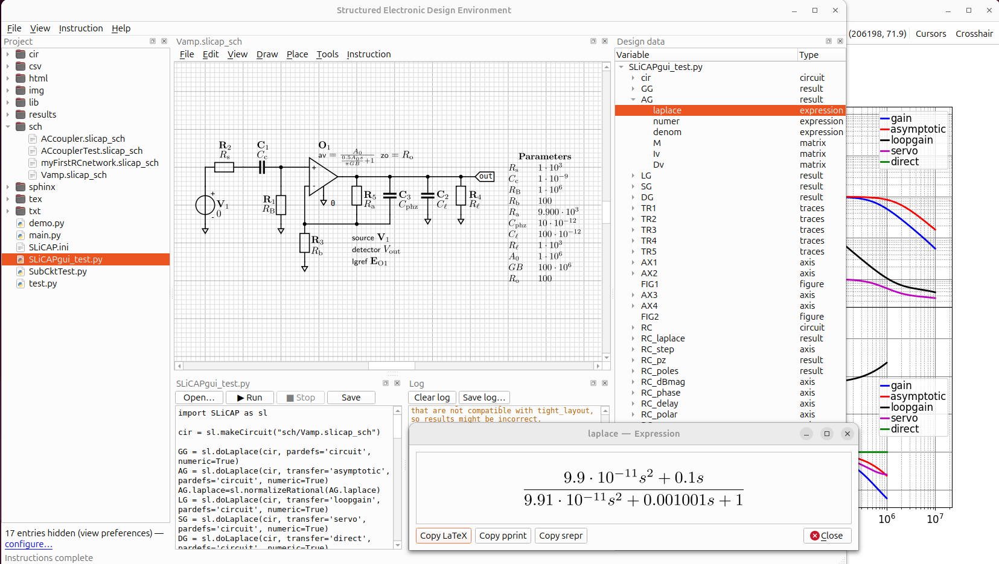

# SLiCAP — more than symbolic SPICE

**Analog design is complex.**\
**Systems engineering tells us how engineers solve complex problems.**\
**SLiCAP makes it doable.**

A simulator tells you what your circuit does — *after* you have chosen the
components. SLiCAP tells you what the components must be: it turns a circuit into
**symbolic design equations**, so values follow from your requirements instead of
from guessing and re-simulating.

Since version 5.2 it comes with the **Structured Electronic Design Environment**,
which integrates SLiCAP and NGspice into one workspace. It keeps every design
decision traceable — from the specification, through the budgets, to the final
design report — so you can design **first-time-right**.
```
pip install slicap        # then start the environment with:  slicap
```

## From specification to design report, in one chain

- **Specification.** Functions, performance and cost requirements are written down as
  project data — the reference every later decision is checked against, not a note in
  the margin.
- **Budgeting.** SLiCAP expresses performance and cost as explicit functions of your
  device properties — you allocate each contribution its share of the requirement, and
  solving the expression gives the value that property must have. Noise, DC variance,
  tolerance, matching and temperature drift all budget the same way.
- **Design and verification, one environment.** Create and solve design equations
  with simple, solvable models, and verify your design with NGspice's full device
  models.
- **Report generation.** Create graphs, LaTeX and RST snippets from expressions,
  tables and NGspice simulations. Put them in your LaTeX design documents and
  Sphinx websites, and keep them up to date with one run.

Nothing is locked in: the environment writes a plain Python script you can read,
edit, run from the command line, or import from your own design code — and SLiCAP
works perfectly well without the GUI.

SLiCAP is the tool set behind the open-access book
**[Structured Electronic Design](https://books.open.tudelft.nl/home/catalog/book/162)**
and the [analog electronics courses](https://analog-electronics.tudelft.nl) at Delft
University of Technology.

## What it looks like



## What it can do

Symbolic and numeric analysis of linear, continuous-time circuits: transfer functions
and their polynomial coefficients, poles and zeros, root-locus plots and Routh arrays,
noise and noise integration, DC variance for tolerance, matching and temperature
budgets, inverse Laplace and network solutions.

Feedback circuits are analysed with the **asymptotic-gain model** — loop gain,
asymptotic gain, servo function and direct transfer, each available on its own.
Balanced circuits are converted into their **common-mode and differential-mode
equivalent circuits**, so each mode is designed for what it must do.

Out of all of it come the design equations for bandwidth, frequency response, noise,
dc variance and temperature stability. Hierarchical netlists, parameter stepping, and
NGspice for numeric verification.

**→ Full documentation, tutorials and examples: [slicap.org](https://slicap.org)**

## About

SLiCAP is an open-source Python program by
[Anton J.M. Montagne](https://montagne.nl), created for and used in structured
analog design practice, teaching and research.

**Two companions to install.** [NGspice](https://ngspice.sourceforge.io) is the
verification half of the environment — install it and your design is simulated with full
device models from inside the same project. A TeX distribution (`pdflatex` + `dvisvgm`)
typesets the expressions on your schematics and builds your LaTeX design reports;
without it SLiCAP falls back to plain text — readable, but not what you want in a
document. Sphinx comes with SLiCAP, so design documentation as a website needs nothing
extra.

See [slicap.org](https://slicap.org) for installation details and for building
from source.

## Contributing

Ideas and contributions are welcome — [email us](mailto:anton@montagne.nl).
Found a bug? Please report it on the *Issues* page.
