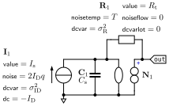

==============================
Create a SLiCAP circuit object
==============================
    
.. image:: /API/img/colorCode.svg

SLiCAP output displayed on this manual page, is generated with the script: ``circuit.py``, imported by ``Manual.py``.

.. literalinclude:: ../circuit.py
    :linenos:
    :lines: 1-7
    :lineno-start: 1

Netlist
=======

SLiCAP accepts SPICE-like netlists as input. SLiCAP can create netlist files from schematic files created with:

- **SLiCAP (preferred)**
- `KiCAD <https://www.kicad.org/>`_
- `LTspice <https://www.analog.com/en/resources/design-tools-and-calculators/ltspice-simulator.html>`_
- `gSchem for MSWindows <https://elektroniq.iqo.uni-hannover.de/doku.php?id=english:geda_for_ms-windows>`_
- `Lepton-EDA <https://github.com/lepton-eda/lepton-eda>`_

To this end, SLiCAP provides symbol libraries for the above programs.

Netlists files can also be created manually using a plain ascii editor. 

The SLiCAP netlist syntax slightly deviates from the SPICE netlist syntax; it is described in section `Device Models <../syntax/SLiCAPnetlistSyntax.html#slicap-netlist-syntax>`__. 

Creation of a `SLiCAP circuit object <../reference/SLiCAPprotos.html#SLiCAP.SLiCAPprotos.circuit>`__ from a schematic file or a netlist file or from a schematic file is performed with the instruction ``makeCircuit()``:

.. literalinclude:: ../circuit.py
    :linenos:
    :lines: 9-13
    :lineno-start: 9
    
SLiCAP netlist files will obtain the extension ".cir" and are placed in the ``ini.cir_path`` directory. If a file with extension ".cir" is passed to ``makeCircuit()``, no netlist is generated, but the circuit object is created from the existing netlist file.

Below the netlist file created with the above script.

.. literalinclude:: ../cir/Transimpedance.cir

Drawing-size images in ``pdf`` and ``svg`` format are placed in the ``img/`` folder of the project directory.

Below the ``svg`` image file created with the above script.

    
SLiCAP selects the netlister from the file extension and the operating system. 

.. list-table:: Netlist generation
   :widths: auto
   :header-rows: 1

   * - File Extension
     - MSWindows netlister
     - Linux and MacOS netlister
   * - .slicap_sch
     - SLiCAP
     - SLiCAP
   * - .kicad_sch
     - KiCAD
     - KiCAD
   * - .asc
     - LTspice
     - LTspice
   * - .sch
     - gschem gnetlist noqsi
     - Lepton-EDA gnetlist noqsi
   * - .cir
     - Use exsisting netlist
     - Use exsisting netlist

For a complete description of the function ``makeCircuit()`` see `makeCircuit <../reference/SLiCAPshell.html#SLiCAP.SLiCAPshell.makeCircuit>`__.

Configuring schematic capture programs
======================================

Below some notes for configuring schematic capture software for working with SLiCAP.

KiCAD
-----

**KiCAD** is the preferred schematic capture tool for SLiCAP. This is because it works on all platforms and supports creation of both ``pdf`` and ``svg`` image files. 

.. admonition:: Important

   SLiCAP schematics created with KiCAD, should only comprise symbols from the SLiCAP KiCAD symbol library: 
   
   .. code block:: python

   >>> import SLiCAP as sl
   >>> sl.ini.kicad_syms
   '/home/USR/ENV/lib/python3.12/site-packages/SLiCAP/files/kicad/SLiCAP.kicad_sym'
   
This library must be added to the KiCAD project. 

#. In the KiCAD schematic editor select: Preferences > Manage Symbol Libraries. This will bring up the 'Symbol Libraries' Dialog Box. 
#. There you select the tab: "Project Specific Libraries"
#. Click add "+" to add the library 
#. Enter a Nickname: "SLiCAP" and select the above library path. 

Since this library contains all symbols that can be handled by the netlister, it is good practice to deactivate other libraries. This is done in the 'Global Libraries' tab of the 'Symbol Libraries' Dialog Box.

LTspice
-------

**LTspice** can also be used for netlist generation. 

.. admonition:: Important

   SLiCAP schematics created with LTspice, should only comprise symbols from the SLiCAP LTspice symbol library: 

   .. code-block:: python

      >>> import SLiCAP as sl       
      >>> sl.ini.ltspice_syms
      '/home/USR/ENV/lib/python3.12/site-packages/SLiCAP/files/LTspice/'
       
   This path must be added as LTspice symbol library path. 

LTspice works with Windows and Linux (under Wine). A version for MAC is also available. The MAC version of LTspice differs from the windows version and netlist generation from within the SLiCAP (python) environment for this version is not supported. Netlists can also be generated manually. 
   
gSchem
------

The open source **gSchem** package can also be used in conjunction with SLiCAP. The use of gSchem as front-end for SLiCAP has been tested under Linux and Windows. However, for Linux please use Lepton-EDA instead.

An MSWindows installer for gSchem can be downloaded from: `gEDA-20130122.zip <https://elektroniq.iqo.uni-hannover.de/doku.php?id=english:geda_for_ms-windows>`_. Netlist generation requires the `gnet-spice-noqsi spice netlister <https://github.com/noqsi/gnet-spice-noqsi/tree/geda-gaf>`_. SLiCAP has built-in netlist generation with gSchem and this netlister. 

MSWindows installation of gSchem is straightforward: simply extract the downloaded gEDA-20130122.zip archive and run the installer. In the drop down menu of the "Select Components" dialog box select "Program only", for the rest accept default settings.

The netlister is installed by copying 'gnet-spice-noqsi.scm' from the downloaded and extracted archive to: ``C:\Program Files (x86)\gEDA\gEDA\share\gEDA\scheme\gnet-spice-noqsi``.

You also need to create or modify the file 'gafrc' in the ``~\.gEDA\`` directory. It should have the following content:

.. code-block:: text

   (reset-component-library)
   (component-library "C:/Program Files (x86)/gEDA/gEDA/share/gEDA/sym/slicap")

.. admonition:: Important

   SLiCAP schematics created with gSchem, should only comprise symbols from the SLiCAP gSchem symbol library: 

   .. code-block:: python

      >>> import SLiCAP as sl       
      >>> sl.ini.ini.gnetlist_syms 
      '/home/USER/USER/lib/python3.12/site-packages/SLiCAP/files/gSchem/'
       
Create a folder ``C:\Program Files (x86)\gEDA\gEDA\share\gEDA\sym\slicap`` and copy the contents of the above the gSchem symbol library to this folder.
    
If you wish to have a light background you can create or modify the file ``gschemrc`` in the ``~\.gEDA\`` directory. Its contents must be:

.. code-block:: text

    (load (build-path geda-rc-path "gschem-colormap-lightbg")) ; light background

Be sure you save these two files ``gafrc`` and ``gschemrc`` without any file extension.

Lepton-EDA
----------

Lepton-EDA is a fork of geda-gaf. Please visit `https://github.com/lepton-eda/lepton-eda <https://github.com/lepton-eda/lepton-eda>`_ for more information.

For an overview of SLiCAP symbols for Lepton-EDA, please view the above `gSchem <../syntax/schematics.html#gSchem>`__ section. 

.. admonition:: Important

   SLiCAP schematics created with Lepton-EDA, should only comprise symbols from the SLiCAP lepton-eda symbol library: 

   .. code-block:: python

      >>> import SLiCAP as sl       
      >>> ini.lepton_eda_syms
      '/home/USR/ENV/lib/python3.12/site-packages/SLiCAP/files/lepton-eda/'. 
      
   This library must be added to lepton-eda. 

Create or modify the file: ``~/.config/lepton-eda/gafrc`` with the contents:

.. code-block:: text

    (reset-component-library)
    (component-library "<path to SLiCAP symbol Library>" "SLiCAP")

If you wish to have a light background, you can create or modify the file ``~/.config/lepton-eda/gschemrc`` in your home directory with the contents:

.. code-block:: text

    (load (build-path geda-rc-path "gschem-colormap-lightbg")) ; light background

Be sure you save these two files ``gafrc`` and ``gschemrc`` without any file extension.

SLiCAP uses the **gnet-spice-noqsi** spice netlister. It is included in the latest version of lepton-eda.

For compact node names (important for use in symbolic expressions) you need to reconfigure the default *net name prefix*.

This is how it should be done under Linux:

.. code:: bash

    sudo lepton-cli config --system "netlist" "default-net-name" ""
    
Reserved component names
========================

Below some restrictions for the **reference designators** of current sources in combination with specific analysis modes.

noise analysis: doNoise()
-------------------------

SLiCAP adds noise current sources in parallel with resistors that have a nonzero positive noise temperature. These current sources obtain the reference designator ``I_noise_<resID>``, where ``resID`` is the reference designator of the resistor. After the noise analysis, these sources are removed from the circuit.

.. admonition:: noise analysis
   :class: warning
   
   After noise analysis ``doNoise()``, all independent current sources with reference designators starting with ``I_noise_`` will be removed from the circuit.

dcvar analysis: doDCvar()
-------------------------

SLiCAP adds dc error current sources in parallel with resistors that have a nonzero dcvar value. These current sources obtain the reference designator ``I_dcvar_<resID>``, where ``resID`` is the reference designator of the resistor. After the dcvar analysis, these sources are removed from the circuit. 

.. admonition:: dcvar analysis
   :class: warning
   
   After dcvar analysis ``doDCvar()``, all independent current sources with reference designators starting with ``I_dcvar_`` will be removed from the circuit.

time analysis: doTime()
-----------------------

In future versions, SLiCAP will add current sources with the Laplace transform of the initial conditions in parallel with capacitors and inductors that have nonzero initial conditions. These current sources obtain the reference designator ``I_init_<elID>``, where ``elID`` is the reference designator of the capacitor or inductor.

.. admonition:: time analysis
   :class: warning
   
   In future versions, after time analysis ``doTime()``, all independent current sources with reference designators starting with ``I_init_`` will be removed from the circuit.
   
state space: doStateSpace()
---------------------------

For the state-space representation, SLiCAP expands controlled sources with a Laplace rational transfer into an integrator chain. The state voltages of this chain obtain the names ``V_<i>_<refDes>``, where ``refDes`` is the reference designator of the controlled source and ``i`` an integer:

- Controlled sources, model E, F, G, and H, of which the "value" parameter is a Laplace rational function with a denominator of order :math:`n`, obtain the state voltages ``V_1_<refDes>`` ... ``V_n_<refDes>``.
- Controlled sources, model EZ and HZ, of which the "zo" parameter is a Laplace rational function of order :math:`m`, obtain a second chain with the state voltages ``V_1_zo_<refDes>`` ... ``V_m_zo_<refDes>``, and the voltage ``V_zo_<refDes>`` across the output impedance.

.. admonition:: state space representation
    :class: warning
    
    Node names of the form ``<integer>_<refDes>`` and ``zo_<refDes>``, where ``refDes`` is the reference designator of a controlled source, conflict with the names of the state voltages and should be avoided.
   
balanced circuits
-----------------

SLiCAP can decompose balanced circuits into (unbalanced) differential-mode and common-mode equivalent circuits. This decomposition is based upon pairing of nodes and branches. Paired nodes and branches receive new names with extensions ``_C`` and ``_D`` for common-mode and differential-mode equivalent networks, respectively. 

.. admonition:: balanced circuits
    :class: warning
    
    The use of the extensions ``_C`` and ``_D`` in node names and device names in combination with the instruction argument ``convtype!=None`` should be avoided. This conflicts with the built-in decomposition method. For more information see: `Work with Balanced circuits <balanced.html>`_.

SLiCAP built-in parameters and Sympy reserved symbols
=====================================================

SLiCAP reserved variables
-------------------------

SLiCAP reserved variables are the frequency variable and the Laplace variable.

.. code-block::

    >>> import SLiCAP as sl
    >>> sl.ini.frequency
    f
    >>> sl.ini.laplace
    s

.. admonition:: Important
    :class: note
    
    Conflicts between *function names* in different packages can be prevented from by importing each package in its own namespace:
    
    >>> import SLiCAP as sl
    >>> import sympy as sp
    >>> import numpy as np
    
SLiCAP global parameters
------------------------

.. admonition:: Global Parameters
    :class: note
    
    Global parameters are defined in the file ``SLiCAPmodels.lib`` in the folder given by ``ini.main_lib_path``. If global parameters are found in circuit element expressions or in circuit parameter definitions, SLiCAP automatically adds their global definition to the circuit parameter definitions.

.. literalinclude:: ../../../SLiCAP/files/lib/SLiCAPmodels.lib
    :linenos:
    :lines: 1-19

.. admonition:: CMOS18 EKV model parameters
    :class: note
        
    Built-in CMOS18 EKV model parameter definitions are included in ``SLiCAP.lib`` in the folder given by ``ini.main_lib_path``.
    
.. literalinclude:: ../../../SLiCAP/files/lib/SLiCAP.lib
    :linenos:
    :lines: 132-179
        
Display schematics on html pages and in LaTeX reports
=====================================================

Scalable Vector Graphics ``.svg`` images are preferred for displaying on HTML pages, while Portable Document Format ``.pdf`` is preferred for LaTeX reports.

**makeCircuit()** generates drawing-size ``svg`` and ``pdf`` images of SLiCAP schematics (``.slicap_sch`` and ``.spice_sch`` file types), and places these image files in the ``img/`` folder in the project directory.

Schematic file locations
========================

A convenient way of working is to save your schematic circuit files in subfolders in the project folder. 

Below a project directory structure according to this principle.

.. code-block:: text

   + project folder
   | - SLiCAP.ini
   | - myProject.py
   +-- sch
   |   - slicap_circuit_1.slicap_sch
   |   - slicap_circuit_2.slicap_sch
   |   - ...
   +-- cir
   |   - slicap_circuit_1.cir     <-- created with: sl.makeCircuit("sch/slicap_circuit_1.slicap_sch")
   |   - slicap_circuit_2.cir     <-- created with: sl.makeCircuit("sch/slicap_circuit_2.slicap_sch")
   +-- lib
   +-- img
       - slicap_circuit_1.svg     <-- created with: sl.makeCircuit("sch/slicap_circuit_1.slicap_sch")
       - slicap_circuit_1.pdf     <-- created with: sl.makeCircuit("sch/slicap_circuit_1.slicap_sch")
       
Netlist files (``.cir`` extension) and image files (``.svg`` and ``.pdf`` extensions) shown above, are created with **makeCircuit()** and by default placed in the ``cir`` folder and the ``img`` folder of the project directory, respectively.

Below an example of creating a circuit object from a SLiCAP schematic file. The project folder is ``/USR/myProject/``.

.. code-block:: python

    >>> import SLiCAP as sl
    >>> sl.initProject("my project")
    >>> cir = sl.makeCircuit("sch/slicap_circuit_1.slicap_sch")
    
Obtain circuit elements information
===================================

Information about the circuit elements is available in the ``.elements`` attribute of the circuit object:

.. literalinclude:: ../circuit.py
   :linenos:
   :lines: 15-25
   :lineno-start: 15
   
This yields:

.. code-block:: text

    ==============================================
    refDes    : C1
    nodes     : ['out', '0']
    refs      : []
    model     : C

    Model parameters:
    value = C_s
    vinit = 0

    ==============================================
    refDes    : I1
    nodes     : ['0', 'out']
    refs      : []
    model     : I

    Model parameters:
    value = 0
    noise = 2*I_D*q
    dc = -I_D
    dcvar = sigma_ID**2

    ==============================================
    refDes    : N1
    nodes     : ['out', '0', 'out', '0']
    refs      : []
    model     : N

    ==============================================
    refDes    : R1
    nodes     : ['out', 'out']
    refs      : []
    model     : R

    Model parameters:
    value = R_t
    noisetemp = T
    noiseflow = 0
    dcvar = sigma_R**2
    dcvarlot = 0

For more information about the SLiCAP circuit object, see the: `circuit class definition <../reference/SLiCAPprotos.html#SLiCAP.SLiCAPprotos.circuit>`__

For more information about schematic capture (built-in symbols, models and subcircuits), see `Schematic capture for SLiCAP <schematics.html>`_

Display circuit data on HTML pages and in LaTeX documents
=========================================================

The report module `Create reports <reports.html>`_, discusses how HTML snippets and LaTeX snippets can be created for variables, expressions, equations and tables.

.. image:: /API/img/colorCode.svg
