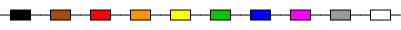

=================================
SLiCAP state-space representation
=================================

The instruction `doStateSpace() <../reference/SLiCAPshell.html#SLiCAP.SLiCAPshell.doStateSpace>`__ returns the state-space representation of a circuit:

.. math::

    \frac{\mathrm{d}\mathbf{x}}{\mathrm{d}t} = \mathbf{A}\mathbf{x} + \mathbf{B}\mathbf{u}, \qquad \mathbf{y} = \mathbf{C}\mathbf{x} + \mathbf{D}\mathbf{u},

in which :math:`\mathbf{x}` is the vector with the state variables, :math:`\mathbf{u}` the vector with the inputs, and :math:`\mathbf{y}` the vector with the outputs. The representation is the full one (MIMO): **every independent source is an input and every nodal voltage and branch current is an output**. The state variables are linear combinations of the network variables, the nodal voltages and branch currents that make up the vector :math:`\mathbf{y}`; conversely, every network variable, also a capacitor voltage or an inductor current that is not a state, follows from the states and the inputs through :math:`\mathbf{C}` and :math:`\mathbf{D}`. A transfer from one source to one detector is read from the representation as a column of :math:`\mathbf{B}` and :math:`\mathbf{D}` and a row of :math:`\mathbf{C}` and :math:`\mathbf{D}`:

.. math::

    H_{ij}(s) = \mathbf{C}_{i,:}\left(s\mathbf{I} - \mathbf{A}\right)^{-1}\mathbf{B}_{:,j} + \mathbf{D}_{i,j}.

The representation is obtained from the first-order MNA matrix :math:`\mathbf{M} = \mathbf{G} + s\mathbf{C}` by an exact reduction:

- The number of state variables equals the number of finite poles of the circuit, i.e. the degree of :math:`\det(\mathbf{M})`. It is **not** the number of capacitors and inductors: a capacitor across a voltage source, an inductor in series with a current source, a capacitor loop, or a pair of ideally coupled inductors contribute no state.
- The reduction works with rational numbers and symbols, so the decision which directions are states is exact; no tolerance is involved. Circuits with symbolic element values give a symbolic representation.
- An output that follows the *derivative* of a source (an improper output, for example the current through a voltage source with a capacitor across it) shows up as a term with the Laplace variable in :math:`\mathbf{D}`.
- The state variables are named after physical quantities wherever the network allows it (the voltage across a capacitor, the current through an inductor); a state that is necessarily a combination of such quantities keeps the name :math:`x_k`.
- Symbolic entries of the matrices are returned in the canonical form of a ratio of polynomials.

Controlled sources with a Laplace-rational transfer (including the operational amplifier models) are expanded into first-order form before the reduction, so their internal states are part of :math:`\mathbf{x}`.

SLiCAP output displayed on this manual page, is generated with the script: ``statespace.py``, imported by ``Manual.py``.

.. literalinclude:: ../statespace.py
    :linenos:
    :lines: 1-7
    :lineno-start: 1

A passive network
=================

.. literalinclude:: ../statespace.py
    :linenos:
    :lines: 10
    :lineno-start: 10

.. image:: /API/img/myPassiveNetwork.svg
    :scale: 80 %

`doStateSpace() <../reference/SLiCAPshell.html#SLiCAP.SLiCAPshell.doStateSpace>`__ takes only the circuit object and, optionally, the conversion type, the parameter definitions and the numeric flag (see `General instruction format <analysis.html#general-instruction-format>`__). The transfer type, the source, the detector, the loop gain reference and the step dictionary do not apply. `listStateSpace() <../reference/SLiCAPmath.html#SLiCAP.SLiCAPmath.listStateSpace>`__ prints the result in the console:

.. literalinclude:: ../statespace.py
    :linenos:
    :lines: 12-13
    :lineno-start: 12

This yields:

.. code-block:: text

    State-space realization: dx/dt = A x + B u, y = C x + D u
    x^T = [V_C2  V_C1  I_L1]
    u^T = [V1]
    y^T = [I_L1  I_V1  V_1  V_2  V_out]
    A = 
    [-R_ell - R_s     -1        ]
    [-------------  -------   0 ]
    [C_a*R_ell*R_s  C_a*R_s     ]
    [                           ]
    [     -1          -1     -1 ]
    [   -------     -------  ---]
    [   C_b*R_s     C_b*R_s  C_b]
    [                           ]
    [                  1        ]
    [      0           -      0 ]
    [                  L        ]
    B = 
    [   1   ]
    [-------]
    [C_a*R_s]
    [       ]
    [   1   ]
    [-------]
    [C_b*R_s]
    [       ]
    [   0   ]
    C = 
    [ 0    0   1]
    [           ]
    [ 1    1    ]
    [---  ---  0]
    [R_s  R_s   ]
    [           ]
    [ 0    0   0]
    [           ]
    [ 1    1   0]
    [           ]
    [ 1    0   0]
    D = 
    [ 0 ]
    [   ]
    [-1 ]
    [---]
    [R_s]
    [   ]
    [ 1 ]
    [   ]
    [ 0 ]
    [   ]
    [ 0 ]

Two capacitors and one inductor, three states, and each state is a physical quantity: the voltages across the capacitors, :math:`V_{C2}` and :math:`V_{C1}`, and the current through the inductor, :math:`I_{L1}`. The first row of :math:`\mathbf{A}` is the node equation of ``out``: the current that arrives through :math:`R_s` and the parallel pair :math:`C_1 \parallel L_1`, :math:`(V_1 - V_2)/R_s`, charges :math:`C_a` and flows through :math:`R_{ell}`; the second row is the node equation of node ``2``, where the same current splits between :math:`C_b` and :math:`L`; the third row is the branch equation of the inductor, :math:`L\,\mathrm{d}I_{L1}/\mathrm{d}t = V_{C1}`. The one input is the source voltage :math:`V_1`, and the five outputs are the network variables: the node voltage :math:`V_1` has a direct feedthrough only (:math:`\mathbf{D}`), :math:`V_{out}` is a state, and :math:`V_2 = V_{C1} + V_{C2}` and the source current :math:`I_{V1} = (V_{C1} + V_{C2} - V_1)/R_s` are combinations. 

The realization is available as the attribute ``.stateSpace`` of the result, a named tuple with the fields ``A``, ``B``, ``C``, ``D``, ``x``, ``u`` and ``y``:

.. literalinclude:: ../statespace.py
    :linenos:
    :lines: 15-17
    :lineno-start: 15

This yields:

.. code-block:: text

    Matrix([[V_C2], [V_C1], [I_L1]]) Matrix([[V1]]) Matrix([[I_L1], [I_V1], [V_1], [V_2], [V_out]])
    Matrix([[(-R_ell - R_s)/(C_a*R_ell*R_s), -1/(C_a*R_s), 0], [-1/(C_b*R_s), -1/(C_b*R_s), -1/C_b], [0, 1/L, 0]]) Matrix([[1/(C_a*R_s)], [1/(C_b*R_s)], [0]]) Matrix([[0, 0, 1], [1/R_s, 1/R_s, 0], [0, 0, 0], [1, 1, 0], [1, 0, 0]]) Matrix([[0], [-1/R_s], [1], [0], [0]])

Rendered with the formatter (see `Formatters`_ below):

.. include:: ../sphinx/SLiCAPdata/eqn-ss-PN.rst

A capacitor across a voltage source
===================================

.. literalinclude:: ../statespace.py
    :linenos:
    :lines: 21-24
    :lineno-start: 21

.. literalinclude:: ../cir/CacrossV.cir
    :linenos:

This yields:

.. code-block:: text

    State-space realization: dx/dt = A x + B u, y = C x + D u
    x^T = [V_C2]
    u^T = [V1]
    y^T = [I_V1  V_1  V_2]
    A = 
    [  -1   ]
    [-------]
    [C_2*R_1]
    B = 
    [   1   ]
    [-------]
    [C_2*R_1]
    C = 
    [ 1 ]
    [---]
    [R_1]
    [   ]
    [ 0 ]
    [   ]
    [ 1 ]
    D = 
    [          1 ]
    [-C_1*s - ---]
    [         R_1]
    [            ]
    [     1      ]
    [            ]
    [     0      ]

Two capacitors, one state, and it is the voltage across :math:`C_2`: the voltage across :math:`C_1` is dictated by the source, so :math:`C_1` stores nothing of its own, it is rejected as a state variable, and the only time constant is :math:`R_1C_2`. The source, however, has to deliver the current :math:`C_1\,\mathrm{d}V_1/\mathrm{d}t`, which is why the row of :math:`I_{V1}` in :math:`\mathbf{D}` contains the Laplace variable: this output is improper. Rendered with the formatter, showing only the outputs and the feedthrough:

.. include:: ../sphinx/SLiCAPdata/eqn-ss-CV-D.rst

Poles and zeros with the state-space engine
===========================================

The state-space representation is meant for computing transfers: one realization holds every transfer of the circuit. For poles and zeros it offers no accuracy advantage in practice and it is considerably slower than the determinant, so the determinant remains the default engine. SLiCAP has two engines for the poles and zeros of a transfer, selected with the keyword ``method`` of ``doPoles()``, ``doZeros()`` and ``doPZ()``:

- ``method='det'``, the determinant engine. The numerator and the denominator of the transfer are determinants of the MNA matrix, computed exactly (``ini.numer``, ``ini.denom``: minor expansion in Python or in the C++ engine ``MECPP``). The poles and zeros are the roots of these polynomials, found numerically as the eigenvalues of the companion matrix (numpy). Fast. The number of roots is the degree of the polynomial. A coinciding pair of poles is a double root of the polynomial and comes out as two nearby roots.
- ``method='state'``, the state-space engine. The circuit is written as a first-order MNA matrix and reduced exactly to a state matrix :math:`\mathbf{A}` as described above (for the zeros: the state matrix of the numerator system). The number of poles is the size of :math:`\mathbf{A}`, exact by construction. The poles are the eigenvalues of the exact matrix, computed after an exact balancing with the QR algorithm at 30 digits (mpmath), accurate to about :math:`10^{-12}`; coinciding poles are resolved as eigenvalues, not split. Slower than the determinant engine on numeric circuits of the size of the examples (a few tenths of a second for 14 states), because the exact reduction and the high-precision eigenvalues cost more than one determinant.
- ``method=None`` (the default): ``ini.pz_method`` decides for poles, zeros and pz analyses (default ``'det'``); all other analyses use the determinant. Stepped analyses and circuits with symbolic element values always use the determinant.

Both engines give the same number of poles and zeros, because both start from an exact description: the degree of the exact determinant and the size of the exact state matrix are the same number, also for capacitor loops, inductor cut sets, ideal coupling and nullors. Both give the same values, and the test suite holds them to each other. The difference lies in coinciding poles or zeros. The state matrix is exact, the QR algorithm that computes its eigenvalues is not: a double eigenvalue splits at the level of the working precision, 30 digits, and coincides in every displayed digit. A double root of the polynomial splits at the level of the double precision of the root finder, typically in the eighth digit, and shows as two nearby roots. Use ``'state'`` when poles or zeros coincide; use ``'det'`` for speed, root loci and stepped analyses.

.. literalinclude:: ../statespace.py
    :linenos:
    :lines: 27-28
    :lineno-start: 27

This yields:

.. code-block:: text

    DC value of gain: 9.00e-01
    Poles of gain:
     n  Real part [Hz]  Imag part [Hz]  Frequency [Hz]     Q [-] 
    --  --------------  --------------  --------------  --------
     0       -1.57e+06        4.70e+06        4.96e+06  1.58e+00
     1       -1.57e+06       -4.70e+06        4.96e+06  1.58e+00
     2       -1.44e+05        0.00e+00        1.44e+05
    Zeros of gain:
     n  Real part [Hz]  Imag part [Hz]  Frequency [Hz]     Q [-] 
    --  --------------  --------------  --------------  --------
     0        0.00e+00       -5.00e+06        5.00e+06       inf
     1        0.00e+00        5.00e+06        5.00e+06       inf

Three poles, the size of :math:`\mathbf{A}`, and the two zeros of the parallel resonance :math:`C_b L` at :math:`f_s = 5\,\mathrm{MHz}`, where the network transmits nothing.

The project setting ``ini.pz_method`` (``pz_method`` in the ``[math]`` section of the project ``SLiCAP.ini``) selects the engine for instructions that do not pass ``method``; its default is ``'det'``. With ``doMatrix(cir, method='state')`` the first-order (expanded) MNA matrix itself is returned.

Formatters
==========

The LaTeX and RST formatters have the method ``stateSpace(resultObject, label="", parts=None)``. It creates one aligned display: the vectors :math:`\mathbf{x}`, :math:`\mathbf{u}` and :math:`\mathbf{y}` as transposed rows, then the matrices :math:`\mathbf{A}`, :math:`\mathbf{B}`, :math:`\mathbf{C}` and :math:`\mathbf{D}`, one object per line and aligned on the equal sign, so that large matrices never have to share a line. The keyword ``parts`` selects a subset, for example ``parts=("x", "A")``; in LaTeX every line carries the label ``<label>-<name>``. The TXT formatter has ``stateSpace(resultObject)`` with the console listing, and ``stateSpace2html()`` displays the realization on the active HTML page.

.. literalinclude:: ../statespace.py
    :linenos:
    :lines: 31-40
    :lineno-start: 31

The second snippet renders as:

.. include:: ../sphinx/SLiCAPdata/eqn-ss-PN-Ax.rst

Conversion type
===============

With ``convtype='dd'`` or ``convtype='cc'`` the outputs are the differential-mode or common-mode variables of a balanced circuit and the inputs remain the independent sources; the state matrix is that of the dd or cc block. See `The conversion type <analysis.html#the-conversion-type>`__.
