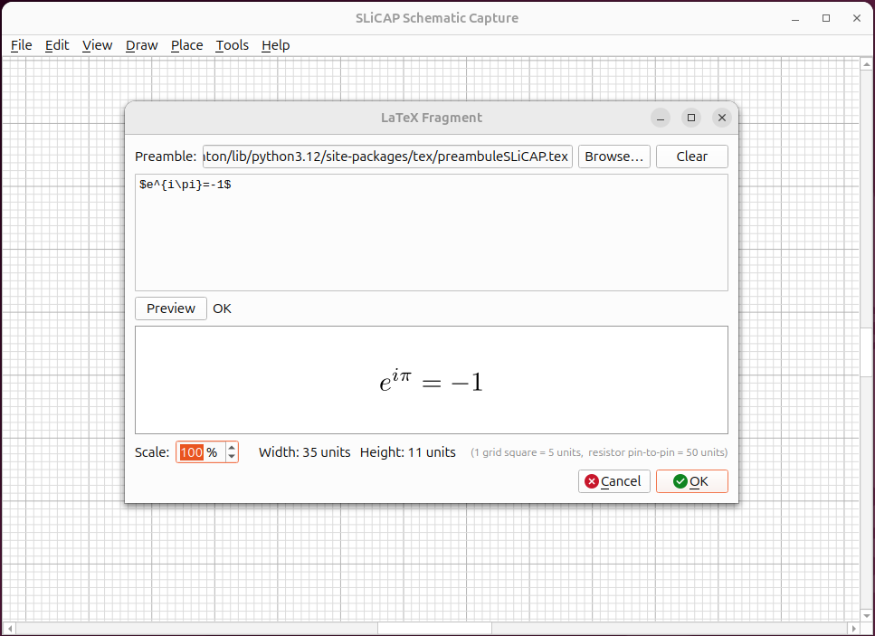

===========
Annotations
===========

Annotations are non-electrical additions that make a schematic into a finished
figure.  They are ignored by the netlister but appear in the SVG/PDF export.

Free text
=========

:menuselection:`Draw --> Text…` (shortcut :kbd:`T`) adds a line of text.  Use it
for notes, titles or callouts.

LaTeX fragments
===============

:menuselection:`Draw --> LaTeX…` adds a block of typeset LaTeX — equations,
aligned derivations, anything a ``standalone`` LaTeX document can produce.
(Requires ``pdflatex`` and ``dvisvgm``.)

   A typeset equation placed next to the circuit it describes.

Hyperlinks
==========

:menuselection:`Draw --> Hyperlink…` adds clickable link text (for example to a
course or datasheet).  In the editor, right-click the link to open or edit it.

Images
======

:menuselection:`Place --> Image…` embeds a raster or vector image — a logo,
a photo of a measurement, a plot.

Drawing primitives
==================

The :menuselection:`Draw` menu also provides simple shapes — **Line**,
**Rectangle** and **Circle** — for framing, grouping or highlighting parts of
the diagram.

Borders and document properties
===============================

* :menuselection:`Place --> Border` (:kbd:`B`) adds a drawing border/frame.
* :menuselection:`File --> Document Properties…` sets the title, author and page
  size, which are used when exporting and printing.

Renaming components
===================

:menuselection:`Tools --> Rename Components…` renumbers reference designators in
bulk — handy after a lot of editing.
