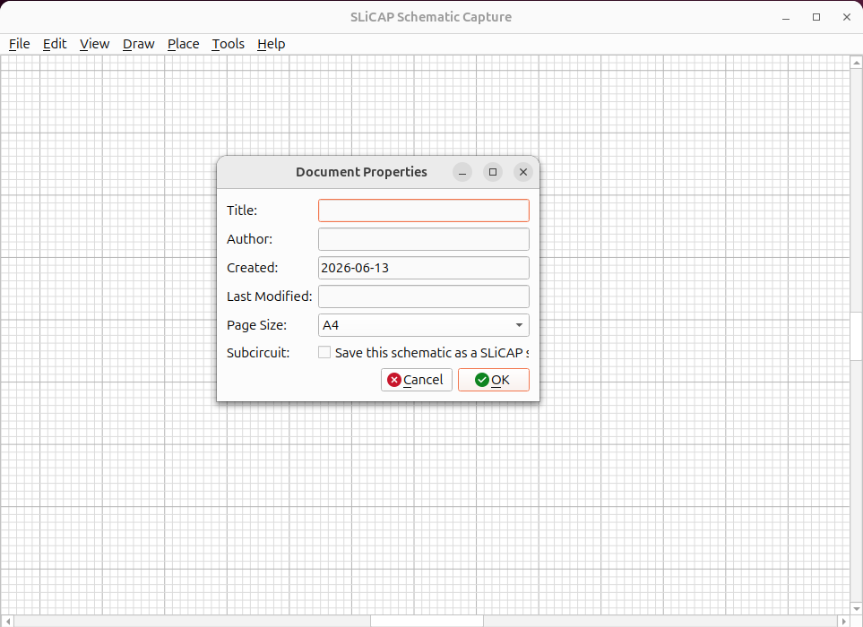

====================
Component Properties
====================

Double-click a placed component (or select it and open its context action) to
edit its properties.

   The Properties dialog: description and documentation link at the top, then
   the reference designator, model, parameters and orientation.

Description and documentation link
==================================

At the top of the dialog the symbol's **description** is shown in bold, and —
when the symbol provides one — a **documentation link**.  The link is taken
from the symbol's ``data-info`` metadata and opens in your web browser; it can
point to a help page, a datasheet or a model definition.

Reference designator
====================

The **refdes** is the element's unique name on the schematic (``R1``, ``C3``,
``N1`` …).  It becomes the element name in the netlist.

Model
=====

Each symbol carries a SLiCAP **model** name.  It is shown for reference and is
written into the netlist.

Parameters
==========

The parameter rows are the values you can set for the element — for example a
resistor's ``value``, or a source's ``dc`` and ``noise``.  The available
parameters come from the symbol itself.

* Enter a **number** (``1k``, ``2.2e-9``) or a **symbolic expression** wrapped in
  braces, e.g. ``{R_s}`` or ``{1/(2*pi*R*C)}``.
* Braced expressions are typeset through LaTeX on the canvas (when ``pdflatex``
  and ``dvisvgm`` are available); otherwise they are shown as plain text.

References
==========

Some elements reference another element — for example a current-controlled
source (``H``/``F``) names the voltage source whose current it senses, and a
coupling factor ``K`` names the two inductors it couples.  These appear as
**ref** rows.

Showing and hiding labels
=========================

For each property there are two check-boxes:

* **Show value** — draw a label for this property on the canvas.
* **Show name** — prefix the value with its name (``value: 1k`` instead of
  ``1k``).  Only available when *Show value* is on.

Labels you switch on can be dragged to any position around the symbol; a thin
dashed leader line connects a label to its component while it is selected.

Orientation
===========

The lower part of the dialog sets:

* **Rotation** — 0°, 90°, 180° or 270°.
* **Mirror horizontal / vertical** — flip the symbol.

Labels stay upright and readable regardless of the symbol's orientation.
