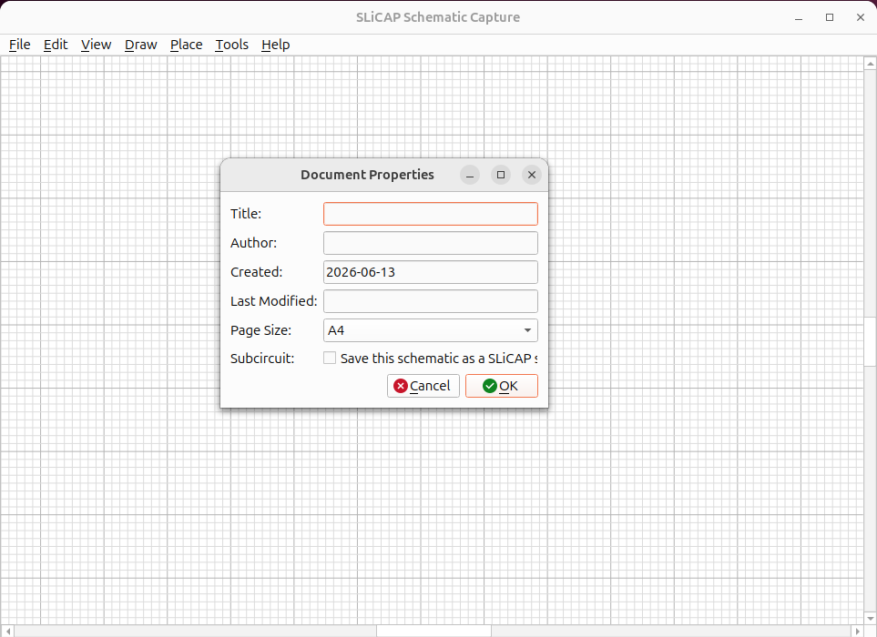

====================
Component Properties
====================

Double-click a placed component (or select it and open its context action) to
edit its properties.

   The Properties dialog: description and documentation link at the top, then
   the reference designator, model, parameters and orientation.

Description and documentation link
==================================

At the top of the dialog the symbol's **description** is shown in bold, and —
when the symbol provides one — a **documentation link**.  The link is taken
from the symbol's ``data-info`` metadata and opens in your web browser; it can
point to a help page, a datasheet or a model definition.

Reference designator
====================

The **refdes** is the element's unique name on the schematic (``R1``, ``C3``,
``N1`` …).  It becomes the element name in the netlist.

Model
=====

Each symbol carries a SLiCAP **model** name.  It is shown for reference and is
written into the netlist.

Parameters
==========

The parameter rows are the values you can set for the element — for example a
resistor's ``value``, or a source's ``dc`` and ``noise``.  The available
parameters come from the symbol itself.

* Enter a **number** (``1k``, ``2.2e-9``) or a **symbolic expression** wrapped in
  braces, e.g. ``{R_s}`` or ``{1/(2*pi*R*C)}``.
* Braced expressions are typeset through LaTeX on the canvas (when ``pdflatex``
  and ``dvisvgm`` are available); otherwise they are shown as plain text.

Value notation (scale factors)
==============================

All values entered in the GUI — component values, parameters, and the fields
of the instruction dialogs — use **SLiCAP notation**. Scale factors are
**case-sensitive**:

.. list-table::
   :header-rows: 1
   :widths: 20 20 20 20 20

   * - ``y`` = 1e-24
     - ``z`` = 1e-21
     - ``a`` = 1e-18
     - ``f`` = 1e-15
     - ``p`` = 1e-12
   * - ``n`` = 1e-9
     - ``u`` = 1e-6
     - ``m`` = 1e-3  *(milli)*
     - ``k`` = 1e3
     - ``M`` = 1e6  *(mega)*
   * - ``G`` = 1e9
     - ``T`` = 1e12
     - ``P`` = 1e15
     -
     -

.. admonition:: NGspice schematics
   :class: note

   NGspice itself reads scale factors *case-insensitively* (``m`` **and**
   ``M`` are milli; mega is ``Meg``). You still enter SLiCAP notation —
   SLiCAP translates automatically wherever values are written into NGspice
   input (netlists, ``.param`` lines, instruction arguments): ``1M`` becomes
   ``1Meg``, and suffixes NGspice does not know (``y``, ``z``, ``a``, ``P``)
   are expanded numerically. The only exception is **numeric literals inside
   hand-written brace expressions** like ``{2.2k/R}``: these are passed to
   NGspice untouched, so use exponent notation (``2.2e3``) or NGspice
   notation there.

References
==========

Some elements reference another element — for example a current-controlled
source (``H``/``F``) names the voltage source whose current it senses, and a
coupling factor ``K`` names the two inductors it couples.  These appear as
**ref** rows.

Showing and hiding labels
=========================

For each property there are two check-boxes:

* **Show value** — draw a label for this property on the canvas.
* **Show name** — prefix the value with its name (``value: 1k`` instead of
  ``1k``).  Only available when *Show value* is on.

Labels you switch on can be dragged to any position around the symbol; a thin
dashed leader line connects a label to its component while it is selected.

Orientation
===========

The lower part of the dialog sets:

* **Rotation** — 0°, 90°, 180° or 270°.
* **Mirror horizontal / vertical** — flip the symbol.

Labels stay upright and readable regardless of the symbol's orientation.

DC operating-point annotation (NGspice)
=======================================

On NGspice schematics, independent voltage sources and inductors offer a
**Show DC operating current** check-box in their Properties dialog, and the
Net Label dialog (double-click a wire) offers **Show DC operating voltage**.
Checking them places an ``I: <value>`` / ``V: <value>`` text on the canvas.

The values come from the circuit's most recent *unstepped* operating-point
run (``sl.op(...)`` in the instruction file, which writes
``cir/<circuit>_op.raw``); they are updated after every run, shown greyed
and italic while no results are available (``V: —``) or after the schematic
was edited (stale), and are **never stored in the schematic file** — only
the check-box and the label position are.

Currents follow the NGspice sign convention: ``I(V...)`` and ``I(L...)``
are measured *into* the positive terminal, so a source that delivers
current to the circuit reads **negative**.  A 0 V voltage source in series
with a branch therefore acts as an ammeter for that branch.

Colour, font, and the number of digits are set in the schematic
preferences under **Bias annotation** (engineering notation with SLiCAP
scale factors, e.g. ``1.23m``).
