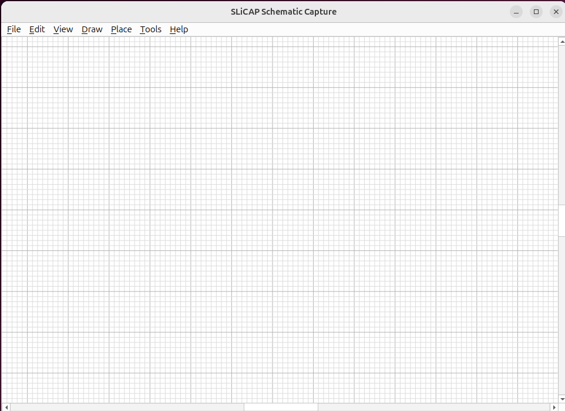

===============
Getting Started
===============

Requirements
============

* Python 3.10 or newer
* `PySide6 <https://pypi.org/project/PySide6/>`_ (the Qt 6 bindings)
* A working **SLiCAP** installation (used for symbol metadata and for typesetting
  parameter values)
* For LaTeX-typeset labels and figure export: ``pdflatex`` and ``dvisvgm``
  (a TeX distribution such as TeX Live).  These are optional — without them the
  editor falls back to plain-text labels.

Launching the editor
====================

**From a Python session or Jupyter notebook** (the usual way):

.. code-block:: python

   import SLiCAP as sl
   sl.initProject("My Design")

   sl.startSchematic()                              # blank canvas, full symbol library
   sl.startSchematic(config='basic')               # blank canvas, basic symbols only
   sl.startSchematic(file='sch/mydesign.slicap_sch')          # open an existing file
   sl.startSchematic(config='basic', file='sch/mydesign.slicap_sch')

The call returns immediately; the editor runs as an independent process alongside
the Python session.

``config`` controls which symbols are available in the *Place → Symbol* menu:

.. list-table::
   :header-rows: 1
   :widths: 15 85

   * - ``config``
     - Symbol set loaded
   * - ``'full'`` *(default)*
     - All SVG files in the system symbols directory — the complete SLiCAP library.
   * - ``'basic'``
     - ``Symbols.svg`` only (the standard IEC/SLiCAP set, without e.g. the MOSFET
       symbol ``M``).  Use this when your project does not need device-level
       symbols.

``file`` is the path to a ``.slicap_sch`` file to open at startup.
If omitted, the editor opens with a blank schematic.

**From the command line** (for scripting or desktop shortcuts):

.. code-block:: console

   $ python -m SLiCAP.schematic.main                            # blank, full library
   $ python -m SLiCAP.schematic.main --config basic             # blank, basic library
   $ python -m SLiCAP.schematic.main sch/mydesign.slicap_sch   # open file
   $ python -m SLiCAP.schematic.main --config basic sch/mydesign.slicap_sch

The main window opens with an empty canvas (or the specified schematic).

   The main window: menu bar, symbol palette (left) and the drawing canvas.

A first schematic in five steps
===============================

#. **Place a symbol.**  Open :menuselection:`Place --> Symbol…` (shortcut
   :kbd:`S`), pick a resistor and click on the canvas to drop it.  See
   :doc:`placing_symbols`.

#. **Wire it up.**  Choose :menuselection:`Place --> Wire` (shortcut :kbd:`W`)
   and click from one pin to the next.  Unconnected pins show a small grey
   marker that disappears once a wire reaches them.  See :doc:`wiring`.

#. **Set values.**  Double-click a component to open its **Properties** dialog
   and enter a value (for example ``{R_s}`` for a symbolic resistance).  See
   :doc:`component_properties`.

#. **Mark source and detector.**  Use
   :menuselection:`Place --> Define src / det / lg ref…` to designate the
   independent source and the detector.

#. **Save and export.**  :menuselection:`File --> Save` writes the
   ``.slicap_sch`` file; :menuselection:`File --> Export Netlist…` produces a
   ``.cir`` netlist for SLiCAP.  See :doc:`netlist_and_export`.

The menu bar at a glance
========================

.. list-table::
   :header-rows: 1
   :widths: 18 82

   * - Menu
     - Contents
   * - **File**
     - New (:kbd:`Ctrl+N`), Open (:kbd:`Ctrl+O`), Save (:kbd:`Ctrl+S`),
       Save As (:kbd:`Ctrl+Shift+S`), Document Properties, Export Netlist
       (:kbd:`Ctrl+E`), Export SVG, Export PDF, Print (:kbd:`Ctrl+P`),
       Preferences.
   * - **Edit**
     - Undo (:kbd:`Ctrl+Z`), Redo (:kbd:`Ctrl+Y`).
   * - **View**
     - Fit (:kbd:`F`), Zoom In (:kbd:`+`), Zoom Out (:kbd:`-`),
       Reset Zoom (:kbd:`Ctrl+0`).
   * - **Draw**
     - Line, Rectangle, Circle, Text (:kbd:`T`), Hyperlink, LaTeX.
   * - **Tools**
     - Rename Components.
   * - **Place**
     - Symbol (:kbd:`S`), Wire (:kbd:`W`), Net Label (:kbd:`L`),
       Junction (:kbd:`J`), Border (:kbd:`B`), Library, Image, Parameters,
       Define src / det / lg ref.
   * - **Help**
     - Show HTML Documentation (:kbd:`F1`), About.
