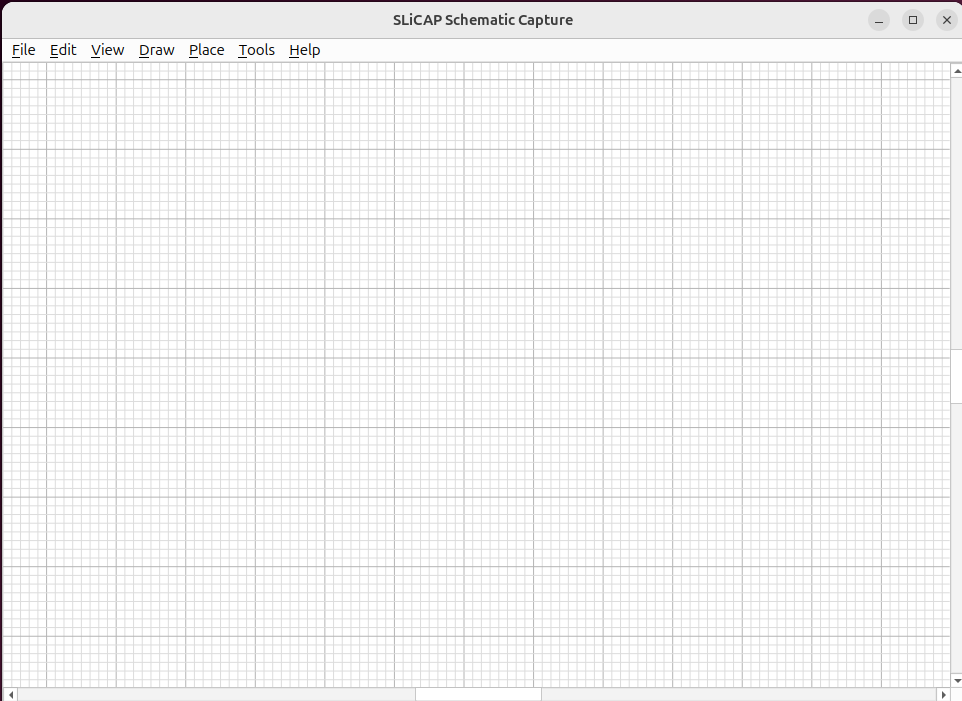

===============
Getting Started
===============

Requirements
============

* Python 3.10 or newer
* `PySide6 <https://pypi.org/project/PySide6/>`_ (the Qt 6 bindings)
* A working **SLiCAP** installation (used for symbol metadata and for typesetting
  parameter values)
* For LaTeX-typeset labels and figure export: ``pdflatex`` and ``dvisvgm``
  (a TeX distribution such as TeX Live).  These are optional — without them the
  editor falls back to plain-text labels.

Launching the editor
====================

**From a Python session or Jupyter notebook** (the usual way):

.. code-block:: python

   import SLiCAP as sl
   sl.initProject("My Design")

   sl.startSchematic()                              # empty editor; choose type from the File menu
   sl.startSchematic(config='basic')                # SLiCAP basic-symbol capture mode
   sl.startSchematic(file='sch/mydesign.slicap_sch')          # open an existing file
   sl.startSchematic(config='basic', file='sch/mydesign.slicap_sch')

The call returns immediately; the editor runs as an independent process alongside
the Python session (schematic-only: no Instruction/Log panels).

``config`` selects the **capture mode**.  It sets the symbol library *and*
restricts which schematic type may be created or opened:

.. list-table::
   :header-rows: 1
   :widths: 12 46 42

   * - ``config``
     - Symbol set loaded
     - Schematic type
   * - ``None`` *(default)*
     - chosen per schematic
     - both SLiCAP and NGspice allowed
   * - ``'basic'``
     - ``Symbols.svg`` only (standard IEC/SLiCAP set, without e.g. the MOSFET
       symbol ``M``)
     - SLiCAP only (NGspice disabled)
   * - ``'slicap'``
     - the complete SLiCAP library (all SVG files in the system symbols directory)
     - SLiCAP only (NGspice disabled)
   * - ``'ngspice'``
     - the NGspice symbol library
     - NGspice only (SLiCAP disabled)

In a restricted mode the disallowed :menuselection:`File --> New ... Schematic`
entry is greyed out and :menuselection:`File --> Open` lists only files of the
permitted type.

``file`` is the path to a schematic to open at startup; its type is inferred from
the extension (``.slicap_sch`` or ``.spice_sch``).  **A canvas is shown only when
a file is given** — otherwise the editor opens empty and you create or open a
schematic from the File menu (honouring the capture mode).

**From the command line** (for scripting or desktop shortcuts):

.. code-block:: console

   $ slicap                                                       # full editor, both types
   $ slicap-schematics                                            # schematic-only editor, empty
   $ slicap-schematics --config basic                             # basic SLiCAP mode, empty
   $ slicap-schematics --config ngspice sch/mydesign.spice_sch    # open an NGspice file
   $ python -m SLiCAP.schematic.main --schematic-only --config basic

Without a ``file`` the editor opens empty; use the File menu to create or open a
schematic in the selected mode.

   The main window: menu bar, symbol palette (left) and the drawing canvas.

A first schematic in five steps
===============================

#. **Place a symbol.**  Open :menuselection:`Place --> Symbol…` (shortcut
   :kbd:`S`), pick a resistor and click on the canvas to drop it.  See
   :doc:`placing_symbols`.

#. **Wire it up.**  Choose :menuselection:`Place --> Wire` (shortcut :kbd:`W`)
   and click from one pin to the next.  Unconnected pins show a small grey
   marker that disappears once a wire reaches them.  See :doc:`wiring`.

#. **Set values.**  Double-click a component to open its **Properties** dialog
   and enter a value (for example ``{R_s}`` for a symbolic resistance).  See
   :doc:`component_properties`.

#. **Mark source and detector.**  Use
   :menuselection:`Place --> Define src / det / lg ref…` to designate the
   independent source and the detector.

#. **Save and export.**  :menuselection:`File --> Save schematic` writes the
   ``.slicap_sch`` file; :menuselection:`File --> Export netlist…` produces a
   ``.cir`` netlist for SLiCAP.  See :doc:`netlist_and_export`.

The menu bar at a glance
========================

Each schematic panel has its own menu bar with actions on that schematic:

.. list-table::
   :header-rows: 1
   :widths: 18 82

   * - Menu
     - Contents
   * - **File**
     - Save schematic (:kbd:`Ctrl+S`), Save schematic as
       (:kbd:`Ctrl+Shift+S`), Schematic properties, Export netlist
       (:kbd:`Ctrl+E`), Export SVG, Export PDF, Print schematic
       (:kbd:`Ctrl+P`), Schematic drawing preferences.
   * - **Edit**
     - Undo (:kbd:`Ctrl+Z`), Redo (:kbd:`Ctrl+Y`).
   * - **View**
     - Fit (:kbd:`F`), Zoom In (:kbd:`+`), Zoom Out (:kbd:`-`),
       Reset Zoom (:kbd:`Ctrl+0`).
   * - **Draw**
     - Line, Rectangle, Circle, Text (:kbd:`T`), Hyperlink, LaTeX.
   * - **Tools**
     - Rename Components.
   * - **Place**
     - Symbol (:kbd:`S`), Wire (:kbd:`W`), Net Label (:kbd:`L`),
       Junction (:kbd:`J`), Border (:kbd:`B`), Library, Image, Parameters,
       Define src / det / lg ref.
   * - **Instruction**
     - Create / edit SLiCAP instruction (SLiCAP schematics) or
       Create / edit NGspice instruction (NGspice schematics); Run, Stop.

Creating and opening schematics, and application-wide actions, live in the
**main window's** menu bar:

.. list-table::
   :header-rows: 1
   :widths: 18 82

   * - Menu
     - Contents
   * - **File**
     - New project, Select project folder, Save project, Close project;
       New SLiCAP Schematic, New NGspice Schematic, Open (:kbd:`Ctrl+O`);
       Exit (:kbd:`Ctrl+Q`).
   * - **Instruction**
     - Create / edit plot; Run (:kbd:`F5`), Stop (:kbd:`F6`).
   * - **View**
     - Show/hide the Project, Instructions, and Log panels.
   * - **Help**
     - Show HTML Documentation (:kbd:`F1`), Check for updates, About.
