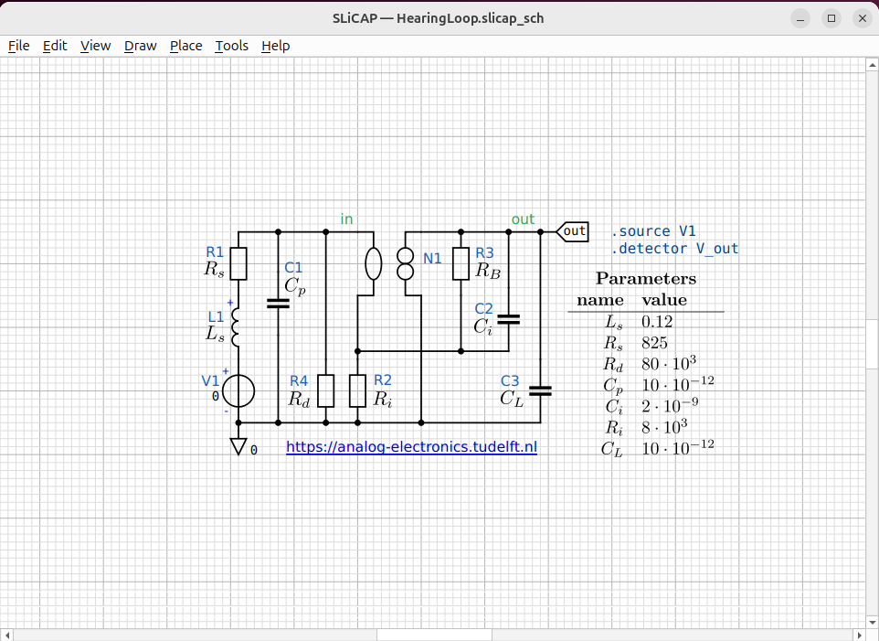

==========================================
SLiCAP Schematic Capture — User Manual
==========================================

A graphical schematic editor for **SLiCAP** (Symbolic Linear Circuit Analysis
Program, https://www.slicap.org) and **NGspice**.  It lets you draw a circuit
once and use the same drawing both as a publication-quality figure *and* as a
runnable netlist — keeping design and documentation a single activity rather
than two that must be manually kept in sync.

   A finished schematic: components, wires, net labels, a parameter table and a
   hyperlink annotation — exported straight to the figure you are reading.

.. note::

   This manual is a **draft**.  The boxed images are placeholders; capture the
   screenshots listed in ``docs/images/PLACEHOLDERS.txt`` and drop them in
   ``docs/images/`` to complete it.

.. toctree::
   :maxdepth: 2
   :caption: Contents

   introduction
   getting_started
   the_canvas
   placing_symbols
   component_properties
   wiring
   labels_ports_parameters
   annotations
   preferences
   project_files
   symbol_libraries
   netlist_and_export
   hierarchical_blocks
   design

Indices
=======

* :ref:`genindex`
* :ref:`search`
