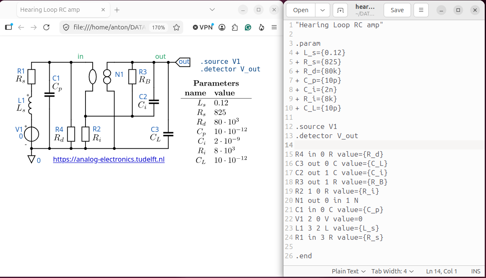

============
Introduction
============

What this tool is
=================

SLiCAP Schematic Capture is a desktop application for drawing electronic
circuit diagrams.  Unlike a pure drawing program, every symbol you place is a
real circuit element: when you are done, the same diagram can be turned into

* a **SLiCAP / SPICE netlist** for symbolic and numeric circuit analysis, and
* a **vector figure** (SVG or PDF) for a report, paper or book.

The guiding idea is that *documentation and design should integrate* — the
figure in your text and the circuit you analyse are one and the same object.

Key features
============

* A grid-based canvas with snapping, zoom and pan.
* A library of IEC-style symbols (resistors, capacitors, inductors, sources,
  controlled sources, the SLiCAP nullor, gyrator and transformer, ground and
  ports).
* Self-describing symbols: every symbol carries its own SLiCAP metadata
  (prefix, nodes, model, parameters, description and a documentation link).
* Smart wiring that keeps connections intact while you rearrange parts.
* Visual markers on unconnected pins so you can see at a glance what still
  needs wiring.
* Component properties with selectable, movable value/parameter labels typeset
  through LaTeX.
* Rich annotations: free text, LaTeX fragments, images, hyperlinks, parameter
  tables and drawing primitives.
* **Self-contained projects**: each schematic keeps its own style, symbol
  copies and render cache in sidecar files next to it (see
  :doc:`project_files`).
* Export to netlist, SVG and PDF — from the GUI or the command line.

How a schematic becomes analysis
================================

   One drawing, two products: a runnable netlist and a publication figure.

#. Draw the circuit on the canvas.
#. Designate the source, detector and (optionally) loop-gain reference.
#. Export the netlist and run it in SLiCAP, or export the SVG/PDF figure.

The remaining chapters walk through each of these steps.
