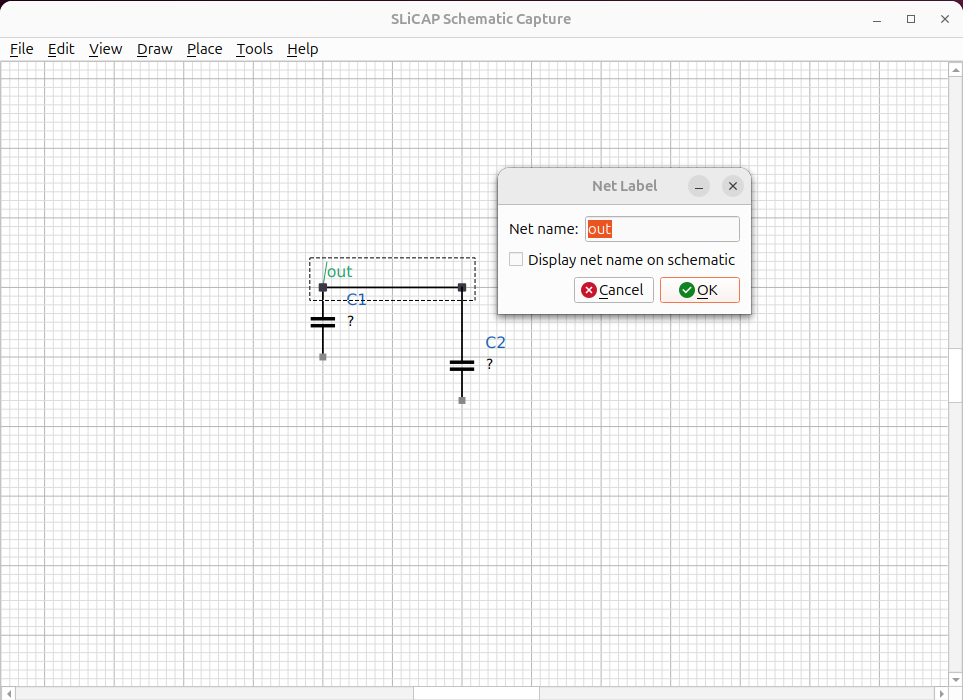
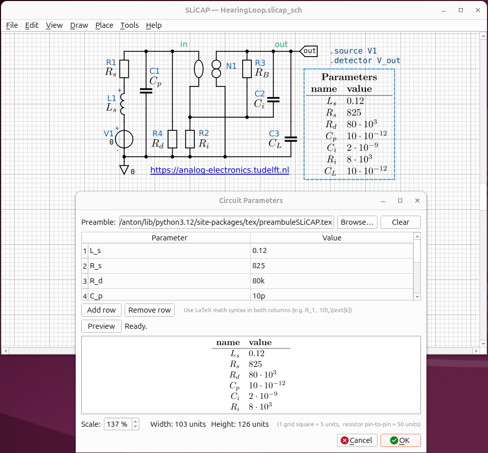

=============================
Net Labels, Ports & Ground
=============================

Ground
======

Place a **ground** symbol (:menuselection:`Place --> Symbol…`, then *ground*) on
any node that is the circuit reference.  Its net is always ``0`` — the SLiCAP /
SPICE reference node.

Net labels
==========

A **net label** gives a wire a readable name (``in``, ``out``, ``vdd`` …) that
is used in the netlist and shown on the drawing.

#. Choose :menuselection:`Place --> Net Label` (shortcut :kbd:`L`) and click the
   wire, **or** double-click a wire segment to open its net-label dialog.
#. Type the name and choose whether to display it.

   A net label naming the output node ``out``.

All wires that are electrically the same net share one name.

Ports
=====

A **port** symbol marks a named connection point.  Two ports with the **same
name** are connected even when no wire runs between them, which keeps busy
drawings readable and is the basis for hierarchical connections.

Parameter definitions
=====================

Use :menuselection:`Place --> Parameters…` to add a **parameter table** to the
schematic — a list of ``name = value`` definitions (for example
``R_s = 825``, ``C_L = 10e-12``).  These become ``.param`` lines in the netlist
and are typeset as a neat table on the figure.

   A parameter table rendered on the schematic.

Designating source, detector and loop-gain reference
====================================================

For a SLiCAP analysis you must say *what* is driving the circuit and *where* you
observe it:

#. Choose :menuselection:`Place --> Define src / det / lg ref…`.
#. Set the **source** (an independent source, e.g. ``V1``), the **detector**
   (a node voltage or branch current, e.g. ``V_out``) and, optionally, the
   **loop-gain reference**.

These are written as the corresponding SLiCAP commands in the netlist.
