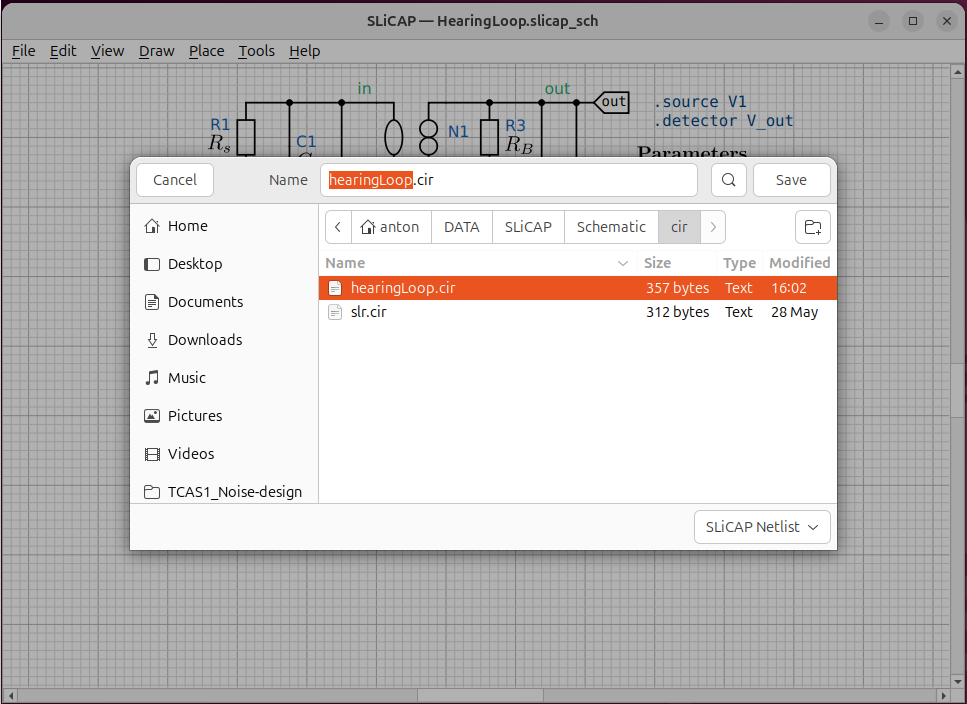

=====================
Netlist & Export
=====================

A finished schematic produces three things: a **netlist** for analysis, and
**SVG** / **PDF** figures for documents.

From the GUI
============

* :menuselection:`File --> Export Netlist…` (:kbd:`Ctrl+E`) writes a SLiCAP
  ``.cir`` netlist.
* :menuselection:`File --> Export SVG…` writes a vector figure.
* :menuselection:`File --> Export PDF…` writes a PDF figure.
* :menuselection:`File --> Print…` (:kbd:`Ctrl+P`) prints the drawing.

   The schematic and the netlist it produced, side by side.

From the command line
=====================

The same outputs can be generated without opening the window — useful for build
scripts and for regenerating every figure in a book:

.. code-block:: console

   $ python -m app.cli netlist  sch/my_circuit.slicap_sch [-o cir/my_circuit.cir]
   $ python -m app.cli svg      sch/my_circuit.slicap_sch [-o img/my_circuit.svg]
   $ python -m app.cli pdf      sch/my_circuit.slicap_sch [-o img/my_circuit.pdf]

If ``-o`` is omitted, the output takes the schematic's name with the new
extension and lands in the project's ``cir/`` (netlist) or ``img/`` (svg/pdf)
directory.

What the netlist looks like
===========================

Each element becomes one line — reference designator, nodes (in the symbol's
node order), any references, the model and the parameters:

.. code-block:: text

   "My Circuit"

   .param R_s = 825
   .param C_L = 10e-12

   .source V1
   .detector V_out

   R1 in 3 R value={R_s}
   N1 out 0 in 1 N
   C3 out 0 C value={C_L}
   ...
   .end

Running it in SLiCAP
====================

Point SLiCAP at the exported ``.cir`` file:

.. code-block:: python

   import SLiCAP as sl
   sl.initProject("My Design")
   cir = sl.makeCircuit("my_circuit.cir")
   result = sl.doNoise(cir, pardefs="circuit", numeric=True)

See https://www.slicap.org for the analysis workflow.
