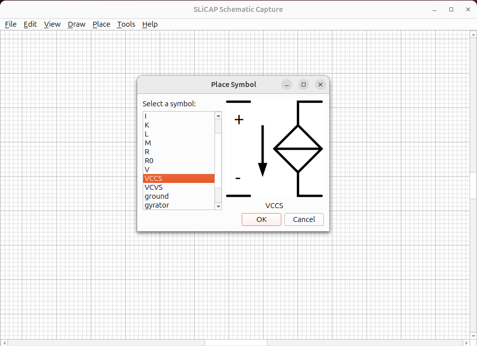

================
Placing Symbols
================

Symbols are the circuit elements you place on the canvas.  Each one is
*self-describing*: it carries its own SLiCAP metadata (device prefix, node
names and order, model name, parameter names, a description and a documentation
link), so the netlister and the Properties dialog need nothing else.

Opening the place dialog
========================

Choose :menuselection:`Place --> Symbol…` (shortcut :kbd:`S`).

   The Place Symbol dialog: pick a symbol from the list; its description is
   shown below the preview.

#. Select a symbol from the list — a preview and its description appear.
#. Click **OK** (or double-click the symbol).
#. Move the mouse onto the canvas and **click** to drop the symbol.
#. Keep clicking to place more copies of the same symbol; press :kbd:`Esc`
   to stop.

Built-in symbols
================

.. list-table::
   :header-rows: 1
   :widths: 22 12 66

   * - Symbol
     - Prefix
     - Description
   * - Resistor
     - ``R``
     - Resistor (nonzero resistance); variant ``R0`` allows zero resistance.
   * - Capacitor
     - ``C``
     - Capacitor.
   * - Inductor
     - ``L``
     - Inductor.
   * - Voltage source
     - ``V``
     - Independent voltage source.
   * - Current source
     - ``I``
     - Independent current source.
   * - VCVS / VCCS
     - ``E`` / ``G``
     - Voltage-controlled voltage / current source.
   * - CCVS / CCCS
     - ``H`` / ``F``
     - Current-controlled voltage / current source.
   * - Nullor
     - ``N``
     - The SLiCAP nullor (ideal amplifier element).
   * - Transformer
     - ``T``
     - Ideal transformer.
   * - Gyrator
     - ``W``
     - Gyrator.
   * - Coupling factor
     - ``K``
     - Mutual-inductance coupling factor.
   * - Ground
     - ``GND``
     - Reference node (net ``0``).
   * - Port
     - ``PORT``
     - Named hierarchical / global connection.

Orienting a symbol
==================

Open a placed component's **Properties** dialog (double-click it) to set its
rotation (0/90/180/270°) and horizontal or vertical mirroring.  See
:doc:`component_properties`.

Unconnected-pin markers
=======================

A freshly placed symbol shows a small grey square on each pin.  These markers
tell you which terminals are not yet wired; each one disappears as soon as a
wire (or another pin) connects to that pin.  Their size and colour are set under
:menuselection:`Preferences --> Wire handles / connections`.

Parameter defaults
==================

When a non-subcircuit symbol is placed, its ``value`` parameter and any
reference designator fields are pre-filled with ``?`` as a reminder that they
must be set before the netlist is valid.  All other parameters (initial
conditions, statistical attributes, etc.) start empty and are omitted from the
netlist until you fill them in.

Double-click the component to open the **Properties** dialog and replace the
``?`` placeholders with real values.

.. note::

   Subcircuit / hierarchical blocks (prefix ``X``) never receive the ``?``
   default because their parameters may be optional or auto-filled by the
   parent hierarchy.
