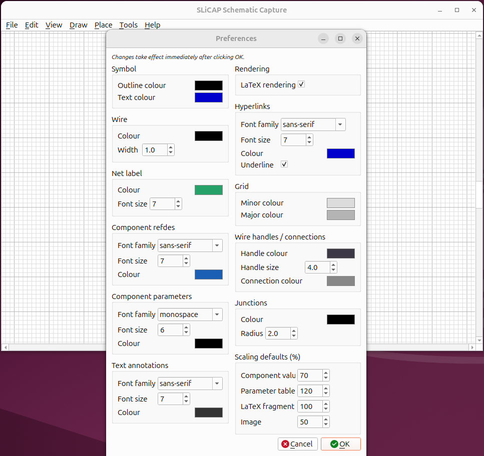

===========
Preferences
===========

:menuselection:`File --> Preferences…` controls the **appearance** of the
current schematic — line widths, colours and fonts.

   The Preferences dialog, grouped by element type.

Per-schematic styling
=====================

Styling works on two levels:

* The application's **global defaults** are the template for every *new*
  schematic.
* When you change a setting in Preferences, it applies to the **current
  schematic** and is saved into its ``<name>.ini`` sidecar file (see
  :doc:`project_files`).  Re-opening that schematic restores exactly the look it
  was saved with — independent of the machine's global defaults.

This is what lets a book or report keep a consistent house style across all its
figures.

What you can change
===================

The dialog is grouped by element type, including:

* **Symbol** — stroke and text colour.
* **Wire** — colour and width.
* **Net label**, **Component refdes**, **Component parameters** — colour, font
  and size.
* **Text annotations**, **Hyperlinks** — fonts and colours.
* **Grid** — minor and major line colours.
* **Wire handles / connections** — the colour and size of wire selection
  handles, and the **connection colour** used for the unconnected-pin markers
  (see :doc:`wiring`).
* **Junctions** — colour and radius.
* **Rendering** — turn LaTeX typesetting of labels on or off.
* **Scaling defaults** — default sizes for parameter tables, LaTeX fragments and
  images.

Changes take effect immediately on the canvas.
