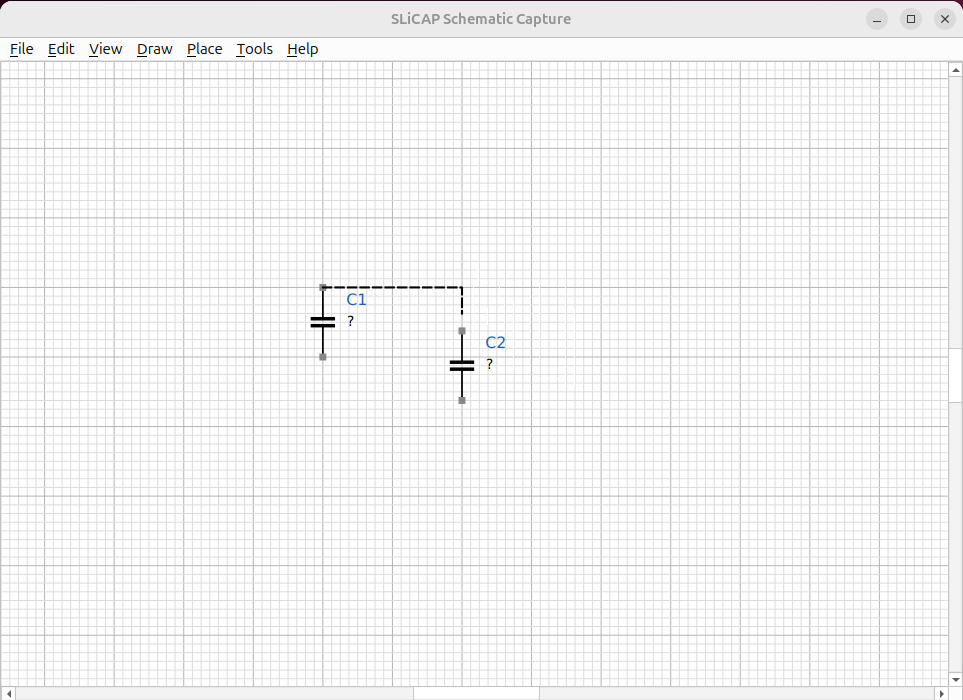
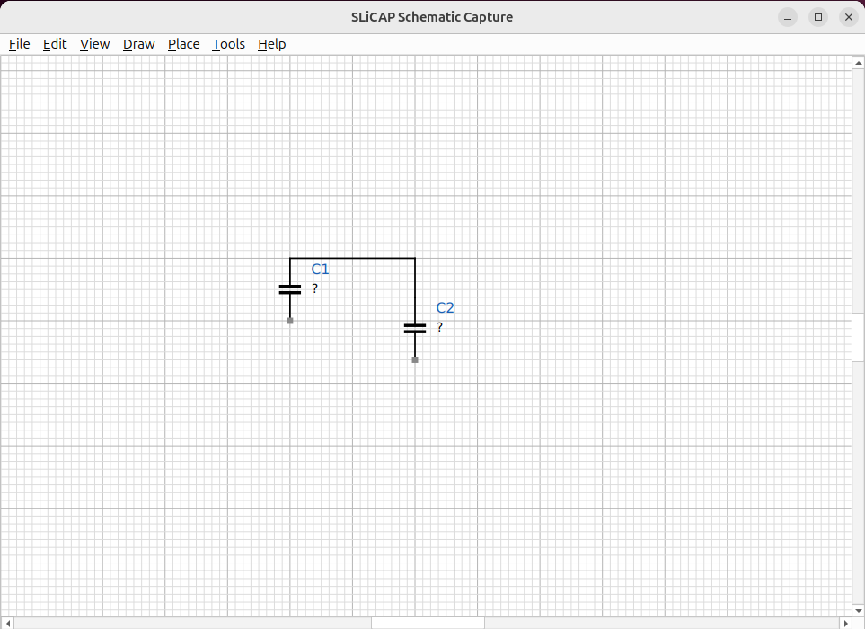

======
Wiring
======

Wires carry the electrical connections between component pins.  Connections are
purely *geometric*: anything that touches the same point is on the same net, so
you never declare connections explicitly — you simply draw.

Drawing a wire
==============

#. Choose :menuselection:`Place --> Wire` (shortcut :kbd:`W`).
#. Click the starting point (usually a pin).
#. Click each corner; the wire routes in right-angle (Manhattan) segments.
#. Click the end point.  Right-click (or press :kbd:`Esc`) to finish.

   Drawing an orthogonal wire from pin to pin.

Junctions
=========

Where three or more connections meet, a **junction dot** is added automatically
so the crossing is unambiguous.  Two crossing wires that should *not* connect
simply have no dot.  You can also place a junction explicitly with
:menuselection:`Place --> Junction` (:kbd:`J`).

Unconnected-pin markers
=======================

Every component pin with nothing attached shows a small grey square.  As soon as
a wire reaches the pin — or another pin sits on the same point — the marker
disappears; if you later delete or move the wire away, the marker returns.  This
gives you a running check that the circuit is fully wired.

   Grey markers flag the pins that still need a connection.

Moving wires and parts keeps connections
========================================

A guiding rule governs every move:

   **Moving never breaks a connection. Only deleting a wire removes a
   connection.**

In practice:

* **Move a component** that is wired up, and the wires stretch to follow it.
* **Move a component off a pin it was touching**, and a short connecting wire is
  created automatically so the connection is preserved.
* **Move a wire** that is connected to a component, and it stays connected —
  a short bridge wire is created rather than silently detaching.

To actually *disconnect* something, delete the wire segment.

Editing a wire
==============

* **Select** a wire to show square handles at its vertices.
* **Drag a vertex** to reshape a single corner.
* **Drag the body** of a selected wire to move a whole segment; adjacent wires
  rubber-band along so the net stays intact.

.. tip::

   After moving a wire segment it stays selected, so you can immediately drag it
   again — no need to reselect.

Net names
=========

By default the editor assigns net numbers automatically.  To give a net a
meaningful name, attach a **net label** (see :doc:`labels_ports_parameters`).
