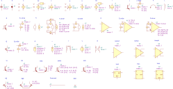
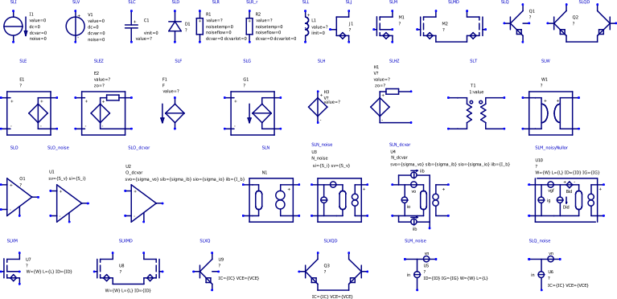
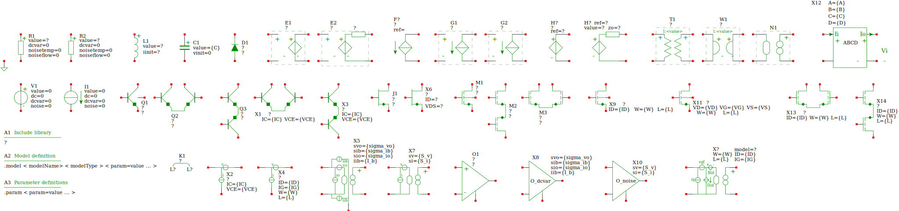

============================
Schematic capture for SLiCAP
============================

.. image:: ../img/colorCode.svg

.. kicad:

KiCAD
======

Symbols for schematic capture and netlist generation with KiCAD are stored in the ``kicad/`` folder in the install path.

.. code-block:: python

    >>> import SLiCAP as sl
    >>> sl.ini.kicad_syms
    
    '/home/USR/ENV/lib/python3.12/site-packages/SLiCAP/files/kicad/SLiCAP.kicad_sym'
    
The table below lists the KiCAD symbols for SLiCAP.

Model descriptions can be found in the `Device Models <../syntax/devices.html#devices-and-built-in-models>`__ section.

============== ======================================================================= ====== ==================================
name           description                                                             models corresponding sub circuits
============== ======================================================================= ====== ==================================
C              Linear capacitor                                                        C
Command        Spice directive (use for .param, .model .source, .detetcor, .lgref)
D              Small-signal diode model                                                D
E              Voltage-controlled voltage source                                       E
EZ             Voltage-controlled voltage source with series impedance                 EZ
F              Current-controlled current source                                       F
G              Voltage-controlled current source                                       G
GND            Node "0" reference or ground node symbol
H              Current-controlled voltage source                                       H
HZ             Current-controlled voltage source with series impedance                 HZ
I              Independent current source                                              I
J              Small-signal model of a Junction FET                                    J
J_noise        Equivalent-input noise sources of intrinsic JFET                               J_noise
K              Coupling factor (between two inductors)                                 K
L              Linear inductor                                                         L
M              Small-signal model of a four-terminal MOS transistor                    M
M_noise        Subcircuit input-referrd noise sources of intrinsic MOS, EKV model                     NM18_noise, PM18_noise
N              Nullor                                                                  N
N_noise        Subcircuit nullor with input noise sources                                     N_noise
N_dcvar        Subcircuit nullor with input bias and offset sources (separate ground)         N_dcvar
O              Small-signal model of an operational amplifier                          OC, OV
O_noise        Subcircuit nullor with input noise sources (opamp symbol)                      O_noise
O_dcvar        Subcircuit nullor with input bias and offset sources (opamp symbol)            O_dcvar
Q              Small-signal model of a bipolar transistor (BJT)                        QV, QL
Q_noise        Subcircuit input-referred noise sources of intrinsic BJT, GP model             Q_noise
R              Linear resistor cannot have zero value                                  R
R_r            Linear resistor can have zero value and tolerance                       r  
T              Ideal transformer (also works for DC!)                                  T
XM             Subcircuit MOS, EKV model saturation region only                               CMOS18N, CMOS18P
XMD            Subcircuit differential pair MOS, EKV model, sat.                              CMOS18ND, CMOS18PD
XMV            Subcircuit MOS, EKV model linear + saturation region                           CMOS18N_V, CMOS18N_P
XM_noisyNullor Subcircuit nullor with EKV MOS input-referred noise sources                    MN18_noisyNullor, MP18_noisyNullor
XQ             Subcircuit BJT, GP model, forward active region                                BJTV4, BJTL4
XQD            Subcircuit differential pair BJT, GP model, fwd. act.                          BJTD
Xamp3          3-terminal amplifier subcircuit symbol
Xamp4          4-terminal amplifier subcircuit symbol
Xamp5          5-terminal amplifier subcircuit symbol
Xio3           3-terminal general purpose subcircuit symbol
Xio4           3-terminal general purpose subcircuit symbol
Zio5           3-terminal general purpose subcircuit symbol
V              Independent voltage source                                              V
W              Ideal gyrator                                                           W
============== ======================================================================= ====== ==================================

Wide table: slide below the table!

The figure below shows the KiCAD symbols for SLiCAP.

Node names
----------

It is recommended to label the nets with names or numbers. This can be done by connecting a label to a net. Net '0' is the ground net; it is labeled as such by connecting the GND symbol to it. SLiCAP will use the node names as subscripts in the names of the nodal voltages. Hence, SLiCAP will name the voltage at node 'out' as 'V_out'. It is recommended to use numbers and/or short meaningful names.

SPICE directives
----------------

Parameter definitions ``.param``, model definitions ``.model``, library definitions ``.lib``, etc. can be placed on a schematic page using the ``Command`` symbol.

.. ltspice:

LTSpice
=======

Symbols for schematic capture and netlist generation with KiCAD are stored in the ``kicad/`` folder in the install path.

.. code-block:: python

    >>> import SLiCAP as sl
    >>> sl.ini.ltspice_syms
    
    '/home/USR/ENV/lib/python3.12/site-packages/SLiCAP/files/LTspice/'
    
The table below lists the LTspice symbols for SLiCAP.

Model descriptions can be found in the `Device Models <../syntax/devices.html#devices-and-built-in-models>`__ section.

========= ======================================================================= ====== =================================
name      description                                                             models corresponding sub circuits
========= ======================================================================= ====== =================================
SLABCD    Sub circuit of a two-port with T1 matrix parameters                            ABCD
SLC       Linear capacitor                                                        C
SLD       Small-signal diode model                                                D
SLE       Voltage-controlled voltage source                                       E
SLEZ      Voltage-controlled voltage source with series impedance                 EZ
SLF       Current-controlled current source                                       F
SLG       Voltage-controlled current source                                       G
SLH       Current-controlled voltage source                                       H
SLHZ      Current-controlled voltage source with series impedance                 HZ
SLI       Independent current source                                              I
SLJ       Small-signal model of a Junction FET                                    J
SLL       Linear inductor                                                         L
SLM       Small-signal model of a four-terminal MOS transistor                    M
SLMD      Small-signal model of a MOS differential pair                           MD
SLM_noise Equivalent-input noise sources of intrinsic MOS, EKV model                     NM18_noise, PM18_noise, J_noise
SLN       Nullor                                                                  N
SLN_noise Nullor with input noise sources                                                N_noise
SLN_dcvar Nullor with input bias and offset sources (separate ground)                    N_dcvar
SLO       Small-signal model of an operational amplifier                          OC, OV
SLO_noise Nullor with input noise sources (opamp symbol)                                 O_noise
SLO_dcvar Nullor with input bias and offset sources (opamp symbol)                       O_dcvar
SLQ       Small-signal model of a bipolar transistor (BJT)                        QV, QL
SLQD      Small-signal model of a BJT differential pair                           QD
SLQ_noise Equivalent-input noise sources of intrinsic BJT, GP model                      Q_noise
SLR       Linear resistor cannot have zero value                                  R
SLR_r     Linear resistor can have zero value and tolerance                       r
SLT       Ideal transformer (also works for DC!)                                  T
SLXM      Sub circuit MOS, EKV model                                                     CMOS18N, CMOS18P
SLXMD     Sub circuit differential pair MOS, horizontal, EKV model                       CMOS18ND, CMOS18PD
SLXQ      Sub circuit BJT, GP model                                                      BJTV4, BJTL4
SLXQD     Sub circuit differential pair BJT, horizontal, GP model                        BJTD
SLV       Independent voltage source                                              V
SLW       Ideal gyrator                                                           W
========= ======================================================================= ====== =================================

Wide table: slide below the table!

The figure below shows the LTSpice symbols for SLiCAP.

SPICE directives
----------------

Parameter definitions ``.param``, model definitions ``.model``, library definitions ``.lib`` can be placed on a schematic page using **spice directives**. LTSpice also defines the coupling between inductors with the aid of spice directives.

.. gschem:

gSchem and lepton-eda
=====================

Symbols for schematic capture and netlist generation with gSchem or Lepton-EDA are stored in different folders:

.. code-block:: python

    >>> import SLiCAP as sl
    >>> sl.ini.gnetlist_syms
    
    '/home/USR/ENV/lib/python3.12/site-packages/SLiCAP/files/gSchem/'
    
.. code-block:: python

    >>> import SLiCAP as sl
    >>> sl.ini.lepton_eda_syms
    
    '/home/USR/ENV/lib/python3.12/site-packages/SLiCAP/files/lepton-eda/'
    
The table below lists the gSchem and Lepton-EDA symbols for SLiCAP.

Model descriptions can be found in the `Device Models <../syntax/devices.html#devices-and-built-in-models>`__ section.

======== ======================================================================= ====== =================================
name     description                                                             models corresponding sub circuits
======== ======================================================================= ====== =================================
0        Node "0" reference or ground node symbol
ABCD     Sub circuit of a two-port with T1 matrix parameters                            ABCD
C        Linear capacitor                                                        C
D        Small-signal diode model                                                D
E        Voltage-controlled voltage source                                       E
EZ       Voltage-controlled voltage source with series impedance                 EZ
F        Current-controlled current source                                       F
G        Voltage-controlled current source                                       G
H        Current-controlled voltage source                                       H
HZ       Current-controlled voltage source with series impedance                 HZ
I        Independent current source                                              I
J        Small-signal model of a Junction FET                                    J
K        Coupling factor (between two inductors)                                 K
L        Linear inductor                                                         L
M        Small-signal model of a four-terminal MOS transistor                    M
MD-H     Small-signal model of a MOS differential pair, horizontal               MD
MD-V     Small-signal model of a MOS differential pair, vertical                 MD
M_noise  Equivalent-input noise sources of intrinsic MOS, EKV model                     NM18_noise, PM18_noise, J_noise
N        Nullor                                                                  N
N_noise  Nullor with input noise sources                                                N_noise
N_dcvar  Nullor with input bias and offset sources (separate ground)                    N_dcvar
O        Small-signal model of an operational amplifier                          OC, OV
O_noise  Nullor with input noise sources (opamp symbol)                                 O_noise
O_dcvar  Nullor with input bias and offset sources (opamp symbol)                       O_dcvar
Q        Small-signal model of a bipolar transistor (BJT)                        QV, QL
QD-H     Small-signal model of a BJT differential pair, horizontal               QD
QD-V     Small-signal model of a BJT differential pair, vertical                 QD
Q_noise  Equivalent-input noise sources of intrinsic BJT, GP model                      Q_noise
R        Linear resistor cannot have zero value                                  R
R_r      Linear resistor can have zero value and tolerance                       r  
T        Ideal transformer (also works for DC!)                                  T
XM       Sub circuit MOS, EKV model saturation region only                              CMOS18N, CMOS18P
XMD-H    Sub circuit differential pair MOS, horizontal, EKV model, sat.                 CMOS18ND, CMOS18PD
XMD-V    Sub circuit differential pair MOS, vertical, EKV model, sat.                   CMOS18ND, CMOS18PD
XMV      Sub circuit MOS, EKV model linear + saturation region                          CMOS18N_V, CMOS18N_P
XQ       Sub circuit BJT, GP model, forward active region                               BJTV4, BJTL4
XQD-H    Sub circuit differential pair BJT, horizontal, GP model, fwd. act.             BJTD
XQD-V    Sub circuit differential pair BJT, vertical, GP model, fwd. act.               BJTD
V        Independent voltage source                                              V
W        Ideal gyrator                                                           W
Z        Impedance can be defined with a Laplace rational                        Z
include  Spice .include directive
modelDef Spice .model directive
parDef   Spice .param directive
======== ======================================================================= ====== =================================
 
Wide table: slide below the table!
   
The figure below shows the gSchem symbols and Lepton-EDA symbols for SLiCAP.

Node names
----------

It is recommended to label the nets with names or numbers. This can be done by connecting a label to a net. Net '0' is the ground net; it is labeled as such by connecting the GND symbol to it. SLiCAP will use the node names as subscripts in the names of the nodal voltages. Hence, SLiCAP will name the voltage at node 'out' as 'V_out'. It is recommended to use numbers and/or short meaningful names.
    
SPICE directives
----------------

Parameter definitions ``.param``, model definitions ``.model``, library definitions ``.lib``, etc. can be placed on a schematic page using the corresponding symbols.

SLiCAP library
==============

SLiCAP comes with a library with device models and subcircuits.

Models of devices and sub circuits are located in the ``/lib`` sub directory of your SLiCAP installation folder. 

.. code-block:: python

    >>> sl.ini.main_lib_path
    
    '/USR/ENV/anton/lib/python3.12/site-packages/SLiCAP/files/lib/'

SLiCAP.lib: models and subcircuits
----------------------------------

The table below gives an overview of the contents of the SLiCAP.lib file. 

An **m** in the type column indicates a device model definition for a SLiCAP built-in model (**.model** directive). 

Model parameters for built-in models can be found in the `Device Models <../syntax/devices.html#devices-and-built-in-models>`__ section. 

An **s** in the type column indicates a sub circuit definition (**.subckt** ... **.ends**). Parameters that can be passed to these subcircuits are listed in the table.

================= ======================================================= ==== ================================ ============== ================== ===============
name              description                                             type parameters                       KiCAD          gschem/Lepton-EDA  LTspice
================= ======================================================= ==== ================================ ============== ================== ===============
AD8610            Voltage-feedback opamp                                  m                                     O              O                  SLO
AD8610_A0         As above, but DC gain symbolic                          m    A0                               O              O                  SLO
AD8065            Voltage-feedback opamp                                  m                                     O              O                  SLO
AD8065_A0         As above, but DC gain symbolic                          m    A0                               0              O                  SLO
OPA209            Voltage-feedback opamp                                  m                                     O              O                  SLO
OPA209_A0         As above, but DC gain symbolic                          m    A0                               O              O                  SLO
OPA211            Voltage-feedback opamp                                  m                                     O              O                  SLO
OPA211_A0         As above, but DC gain symbolic                          m    A0                               O              O                  SLO
OPA300            Voltage-feedback opamp                                  m                                     O              O                  SLO
OPA300_A0         As above, but DC gain symbolic                          m    A0                               O              O                  SLO
OPA627            Voltage-feedback opamp                                  m                                     O              O                  SLO
OPA627_A0         As above, but DC gain symbolic                          m    A0                               O              O                  SLO
NDD03N80Z         Power NMOS                                              m                                     M              M                  SLM
STD7N80K5         Power NMOS                                              m                                     M              M                  SLM
ABCD              Two-port with transmission-1 parameters                 s    A, B, C, D                                      ABCD               SLABCD
N_noise           Nullor with equivalent-input noise sources              s    si, sv                           N_noise        N_noise            SLN_noise
N_dcvar           Nullor with equivalent-input bias and offset            s    sib, sio, svo, iib               N_dcvar        N_dcvar            SLN_dcvar
O_noise           Nullor with equivalent-input noise sources              s    si, sv                           O_noise        O_noise            SLO_noise
O_dcvar           Nullor with equivalent-input bias and offset            s    sib, sio, svo, iib               O_dcvar        O_dcvar            SLO_dcvar
CMOS18N           NMOS CMOS 180nm EKV model                               s    ID, L, W                         XM             XM                 SLXM
CMOS18N_V         NMOS CMOS 180nm EKV model, voltage-controlled           s    VD, VG, VS, W, L                 XMV            XMV                SLXM_V
CMOS18ND          NMOS diff-pair CMOS 180nm EKV model                     s    ID, L, W                         XMD            XMD-H, XMD-V       SLXMD
CMOS18P           PMOS CMOS 180nm EKV model                               s    ID, L, W                         XM             XM                 SLXM
CMOS18P_V         PMOS CMOS 180nm EKV model, voltage-controlled           s    VD, VG, VS, W, L                 XMV            XMV                SLXM_V
CMOS18PD          PMOS diff-pair CMOS 180nm EKV model                     s    ID, L, W                         XMD            XMD-H, XMD-V       SLXMD
CMOS18PN          P-N complementary parallel CMOS 180nm EKV model         s    W_N, L_N, ID_N, W_P, L_P, ID_P   XMPN           XMPN               SLXMPN
BJTV4             Vertical Bipolar Junction Transistor                    s    IC, VCE                          XQ             XQ                 SLXQ
BJTL4             Lateral Bipolar Junction Transistor                     s    IC, VCE                          XQ             XQ                 SLXQ
BJTD              Differential-pair BJT                                   s    IC, VCE                          XQD            XQD-H, XQD-V       SLXQD
NM18_noise        NMOS 180nm equivalent-input noise EKV model             s    ID, IG, W, L                     M_noise        M_noise            SLM_noise
PM18_noise        PMOS 180nm equivalent-input noise EKV model             s    ID, IG, W, L                     M_noise        M_noise            SLM_noise
NM18_noisyNullor  Nullor with NMOS 180nm equivalent-input noise EKV model s    ID, IG, W, L                     XM_noisyNullor XM_noisyNullor     SLM_noisyNullor
PM18_noisyNullor  Nullor with PMOS 180nm equivalent-input noise EKV model s    ID, IG, W, L                     XM_noisyNullor XM_noisyNullor     SLM_noisyNullor
J_noise           MOS/JFET equivalent-input noise sources                 s    ID, IG, W, L                     J_noise        M_noise            SLM_noise        
Q_noise           BJT equivalent-input noise sources, r_b=0               s    IC, VCE                          Q_noise        Q_noise            SLQ_noise
================= ======================================================= ==== ================================ ============== ================== ===============

Wide table: slide below the table!

.. image:: /img/colorCode.svg
