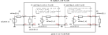

=====================
Work with subcircuits
=====================

.. image:: /img/colorCode.svg

Although SLiCAP is intended to be used for relatively small circuits, it supports unlimited netsing of subcircuits. The function ``makeCircuit()`` recursively expands subcircuits until the final circuit comprises devices with stamp models only (see `Work with models <models.html>`_). Working with subcircuits, usually simplifies the design and is strongly recommended in the following cases:

#. The circuit consists of a number of topologically identical building blocks comprising multiple devices

   - Examples are the built-in subcircuits for small-signal models of active devices and operational amplifiers. 
   
     Below the built-in definition (in ``SLiCAPmodels.lib``) of the small-signal model of a MOS transistor
   
     .. literalinclude:: ../../SLiCAP/files/lib/SLiCAPmodels.lib
         :linenos:
         :lines: 38-48
         :lineno-start: 38
         
#. The circuit consists of a number of building blocks that comprise multiple parameters with complex expressions

   - Examples are the built-in subcircuits for MOS devices with EKV model equations that relate their small-signal parameters to geometry parameters (e.g. W, L) and operating point parameters (e.g ID).
   
     Below the built-in definition (in ``SLiCAP.lib``) of the small-signal model of an CMOS18 NMOS transistor with its small-signal circuit parameters related to its geometry and operating conditions.
     
     .. literalinclude:: ../../SLiCAP/files/lib/SLiCAP.lib
         :linenos:
         :lines: 309-346
         :lineno-start: 346

#. The circuit consists of an anti-series connection of two identical circuits.

   - These circuits belong to the class of 'balanced circuits'. Nodal voltages and branch currents in these circuits can be resolved in differential-mode and common-mode quantities. SLiCAP can decompose a balanced circuit into common-mode and differential-mode equivalent circuits. To this end, it needs pairing information for nodes and branches, which is easy to provide if the balanced circuit consists of the anti-series connection of two identical sub circuits. For more information see: `Work with balanced circuits <balanced.html>`_
  
.. image:: /img/colorCode.svg
   
SLiCAP output displayed on this manual page, is generated with the script: ``subcircuits.py``, imported by ``Manual.py``.

.. literalinclude:: ../subcircuits.py
    :linenos:
    :lines: 1-11
    :lineno-start: 1
    
Subcircuit expansion
====================

Below a schematic diagram of a circuit with nested subcircuits. The main circuit comprises one subcircuit "XA: bigAmp". This subcircuit comprises two identical "smallAmp" subcircuits "X1" and "X2".

    
Subcircuit "XA" has two parameters that can be set by the parent circuit: "A_i", the voltage gain of "X1" and "R_o" the output resistance of both "X1" and "X2". The resistance of "R1" of "XA" is defined symbolically as :math:`R_i` to which no numeric value has been assigned.

Below the manually created netlist of the circuit.

.. literalinclude:: ../cir/hierarchy.cir
    :linenos:
    
At the creation of a circuit object, SLiCAP expands or "flattens" this circuit. It converts the hierarchically structured netlist into a circuit that comprises devices with stamp models only (see `Work with models <models.html>`_). The MNA matrix equation will be constructed from this "flattened" circuit.

Reference designators of expanded circuit elements
--------------------------------------------------

The table below shows the element data of the expanded circuit. 

The first column of this table shows the reference designators of the expanded circuit elements. 

.. admonition:: important
    :class: note
    
    The reference designator of a subcircuit element in its expanded parent is that of the subcircuit element appended with ``_<refX>``, where ``refX`` is the reference designator of the parent subcircuit.
    
    Hence, the reference designator of "R1" in "XA" becomes "R1_XA" in its expanded parent.
    
    This naming process is recursive, so "R1" in "X1" of "XA" becomes "R1_X1_XA" in the expanded parent of "XA".

.. include:: ../sphinx/SLiCAPdata/table-hierarchy-expanded.rst

Expanded circuit node names
---------------------------

The name of a connecting node of a subcircuit, will be that of the connecting parent node.
Unconnected nodes remain local. Their node names will be modified in a similar way as the element reference designator. 

The name of a local node becomes ``<nodeID>_<refX>``, where ``nodeID`` is the node name in the subcircuit, and ``refX`` is the reference designator of the subcircuit in the parent circuit.

Expanded circuit parameter names
--------------------------------

Parents can pass parameter values or expression to child subcircuits. If so, all instances of this parameter in element expression in the subcircuit, in parameter definitions in the subcircuit, and in model definitions in the subcircuit, are substituted with the value or expression passed by the parent.

Parents can only pass parameters that are declared a value or expression in the subcircuit definition. See line 10 from the netlist above:

.. literalinclude:: ../cir/hierarchy.cir
    :linenos:
    :lines: 10
    :lineno-start: 10
    
Hence, the parent can pass a value or expression to :math:`A_i` and to :math:`R_o` to an instance of the subcircuit "bigAmp".

All other parameters will remain local and all instances of local parameters in subcircuit element expressions, in subcircuit parameter definitions, and in subcircuit model definitions, will be substituted with a new variable:

.. code-block:: python

    new_param = sympy.Symbol(str(old_param) + "_" + refX)
    
    # new_param is the new parameter name
    # old_param is the old parameter name (type = sympy.Symbol)
    # refX is the reference designator of the subcircuit in the parent circuit
    
The tables below show how this applies to the circuit from above.

.. include:: ../sphinx/SLiCAPdata/table-hierarchy-pardefs.rst
.. include:: ../sphinx/SLiCAPdata/table-hierarchy-params.rst

Subcircuit creation
===================

Aside from using built-in subcircuits, the user can create subcircuits. There are two ways to create subcircuits:

#. Include a subcircuit definition in a circuit file
#. Create a subcircuit definition in a library file and store it in the ``lib/`` folder of the project directory

Both methods can be done by manually editing circuit ``.cir`` files, the latter one can also be performed with a schematic capture program. 

The manual approach is elucidated above.

Create subcircuits with KiCAD
-----------------------------

KiCAD supports hierarchical design, but the approach differs from the subcircuit approach outlined above. SLiCAP subcircuits must be created as follows:

#. Create a KiCAD schematic for the subcircuit and put a command with the subcircuit decraration on the schematic. The subcircuit definition for "smallAmp" looks as depicted below.

   .. image:: ../img/smallAmp.svg
    :width: 350
    
#. With the ``.subckt`` directive on the schematic, ``makeNetlist()`` creates a library file in the ``lib/`` folder in the project directory. The name of this file defaults to the subcircuit name with extension ``.lib``.

   .. literalinclude:: ../subcircuits.py
       :linenos:
       :lines: 15-16
       :lineno-start: 15
   
   The contents of ``lib/smallAmp.lib`` is:
   
   .. literalinclude:: ../lib/smallAmp.lib
       :linenos:
       
   .. admonition:: Important
       :class: note
       
       SLiCAP library files are like circuit netlists. The first line is taken as title and the last line must be ``.end``.
   
#. Now create the subcircuit ``bigAmp``. Use a 4-pin subcircuit symbol for ``smallAmp``, or create a symbol yourself. Don't forget to include the library with ``smallAmp.lib``.

   .. image:: ../img/bigAmp.svg
    :width: 350

   #. The subcircuit symbol must have four pins and the pin sequence must be according to the subcircuit definition: "inP", "inN", "outP", "outN". The SLiCAP KiCAD symbol ``Xamp4`` can be used for this purpose, it has the correct pin sequence.
   
   #. Parameters to be passed to the subcircuit must added as *symbol properties*. The property *name* is the parameter name and the *value* can be any because it will be overruled by the definition in the ``.subckt`` directive.
   
   The following instruction creates the ``bigAmp`` library file.
   
   .. literalinclude:: ../subcircuits.py
       :linenos:
       :lines: 18-19
       :lineno-start: 18
   
   The contents of ``lib/bigAmp.lib`` is:
   
   .. literalinclude:: ../lib/bigAmp.lib
       :linenos:

#. Now create the main circuit and again use the ``Xamp4`` symbol for ``bigAmp``.

   .. image:: ../img/mainAmp.svg
    :width: 300  
   
   The following instruction creates the main circuit object .
   
   .. literalinclude:: ../subcircuits.py
       :linenos:
       :lines: 21-22
       :lineno-start: 17
   
   The netlist of ``cir/mainAmp.cir`` is:
   
   .. literalinclude:: ../cir/mainAmp.cir
       :linenos:
   
   The expanded circuit data and the parameter definitions are as above:
       
   .. include:: ../sphinx/SLiCAPdata/table-mainamp-expanded.rst    
   .. include:: ../sphinx/SLiCAPdata/table-mainamp-pardefs.rst
   .. include:: ../sphinx/SLiCAPdata/table-mainamp-params.rst

Display circuit data on HTML pages and in LaTeX documents
=========================================================

The report module `Create reports <reports.html>`_, discusses how HTML snippets and LaTeX snippets can be created for variables, expressions, equations and tables.

As a matter of fact, tables and figures on this page are created with this module:

.. literalinclude:: ../subcircuits.py
    :linenos:
    :lines: 24-38
    :lineno-start: 24

.. image:: /img/colorCode.svg
